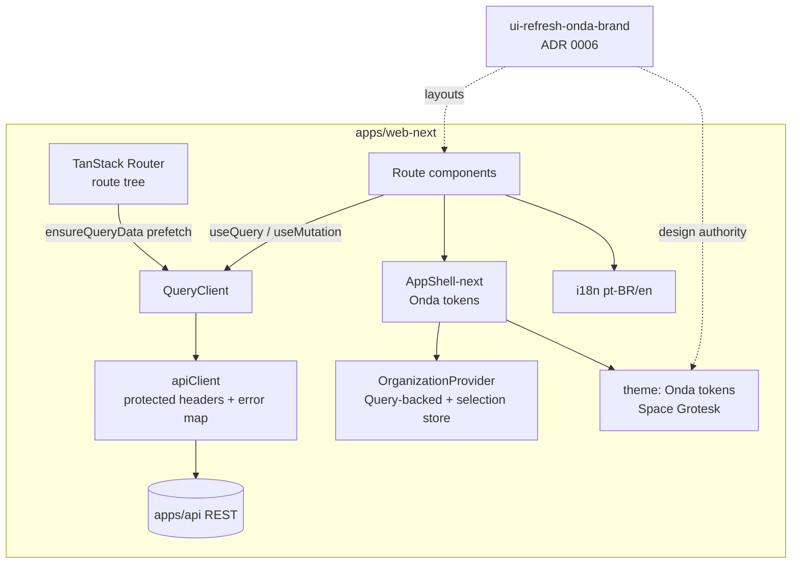

# Frontend rebuild — `web-next` — Design

**Spec**: [`spec.md`](./spec.md)
**Context**: [`context.md`](./context.md)
**Design source**: [`ui-refresh-onda-brand`](../ui-refresh-onda-brand/) (Onda tokens, typography, Volunteer/Leader layouts) · ADR [0006](../../../docs/adr/0006-onda-brand-visual-system.md)
**Preserves**: ADR [0001](../../../docs/adr/0001-visual-system-shell-and-i18n-baseline.md) (shell/i18n/a11y), ADR [0005](../../../docs/adr/0005-system-admin-operator-role.md)
**Status**: Draft

---

## Architecture Overview

`apps/web-next` is a **new package on the same stack** (React 19 · Vite 6 · TanStack Router · Tailwind 4 · i18next) plus **TanStack Query v5** as the single server-state layer. It is built in **layers**, bottom-up, then routes are migrated as **vertical slices**. `apps/web` stays the deployed/CI-green app untouched until a **single production cutover** (see Tech Decisions).



**Layering (build order):**

1. **Foundation** — package scaffold, Onda theme/tokens, Space Grotesk, theme contract test, base shadcn primitives (button, card, input, badge, dialog/sheet) on Onda tokens.
2. **Data core** — `QueryClient`, query-key factory, `apiClient` (port of protected-headers fetch + error contract), auth/session provider, i18n.
3. **Shell** — `AppShell-next` (ADR 0001 behavior, Onda styling), Organization context on Query, grant-gated nav.
4. **Vertical slices** — one route at a time: Volunteer (dashboard/time-away), Leader (dashboard/roster/event detail/create), then functional admin port (org-admin, system-admin).
5. **Cutover** — CI parity, swap deploy, retire `apps/web`, replace `DESIGN_SYSTEM.md`.

---

## Code Reuse Analysis

### Existing modules to port (behavior-preserving, re-expressed on Query)

| Module | Location (`apps/web/src`) | Treatment in `web-next` |
|--------|---------------------------|-------------------------|
| Protected fetch / headers | `apiAuthHeaders.ts` | Port as `apiClient` core; keep dev-header + 401→dev retry contract verbatim |
| Error contract | `apiError.ts` | Port; map to Query error + ADR 0001 hybrid feedback |
| Supabase token | `sessionToken.ts`, `supabaseClient`, `auth/*` | Port auth/session resolution unchanged |
| Org context | `organization/*` (`OrganizationContextProvider`, `fetchOrganizationContext`, `*Storage`, `ministryArchive`) | **Rebuild**: server read via `useQuery`; selection (church/campus/ministry) stays in a small store + localStorage helpers (reused) |
| Domain types | `organization/types.ts`, `identity/types.ts`, `eventDetailPayload` | Reuse types as-is (no visual coupling) |
| Data fns | `events/*`, `identity/*`, `system-admin/*` fetchers | Port into `queryOptions`/mutation fns; same endpoints/payloads |
| i18n | `i18n/*`, `navigation/manifest.ts` | Port resources + controller; extend manifest for grant-gated nav |
| Datetime | `settings/datetimeLocalUtc.ts`, `LocalTimeProvider` | Reuse (campus-authoritative display, SCHED-01) |
| Feedback | `feedback/toastOrchestrator.ts` | Port; wire to mutation lifecycle |

### Rebuild from scratch (HOPE / ADR 0003 — do not carry forward)

`components/ui/*`, `shell/*`, `routes/*.tsx`, `styles/globals.css`, `theme/tokens.ts` (HOPE vars), legacy `/` landing, `DESIGN_SYSTEM.md`.

### Integration Points

| System | Integration |
|--------|-------------|
| `apps/api` REST | Unchanged endpoints; `apiClient` sends same auth/dev headers (`X-Leader-Ministry-Id`, `X-Volunteer-Id`, Bearer) |
| Supabase | Same client + token resolution |
| CI | New filter-scoped jobs for `@onda/web-next` added alongside existing `@onda/web` jobs (parametrized, see CI plan) |

---

## Components

### `apiClient` (data core)

- **Purpose**: Single protected-fetch entry for all Query/mutation fns.
- **Location**: `apps/web-next/src/api/apiClient.ts`
- **Interfaces**:
  - `getJson<T>(path: string, scope: ProtectedScope): Promise<T>`
  - `mutateJson<T>(path: string, scope: ProtectedScope, init: RequestInit): Promise<T>`
- **Reuses**: Port of `buildProtectedHeaders` / `fetchJsonWithProtectedHeaders` (401→dev retry preserved) + `apiError`.

### `queryClient` + query-key factory

- **Purpose**: Shared cache; consistent keys + invalidation.
- **Location**: `apps/web-next/src/query/`
- **Interfaces**:
  - `queryKeys.organizationContext(scope)`, `queryKeys.eventDetail(eventId)`, `queryKeys.events(scope)`, `queryKeys.unavailability(volunteerId)`, `queryKeys.ministryMemberships(...)`, etc.
  - `queryOptions` factories colocated with each domain (e.g. `events/eventDetailQuery.ts`).
- **Dependencies**: `apiClient`, active org scope.
- **Reuses**: existing fetch payload shapes/types.

### `OrganizationProvider` (Query-backed)

- **Purpose**: Resolve churches + active Church/Campus/Ministry selection; expose switchers.
- **Location**: `apps/web-next/src/organization/OrganizationProvider.tsx`
- **Interfaces**: same surface as current `useOrganization()` (`activeChurch`, `activeCampus`, `activeMinistry`, `onChurchChange`, …) but `churches`/`loading`/`error` derive from `useQuery`; `refresh` → `queryClient.invalidateQueries`.
- **Reuses**: `fetchOrganizationContext`, `organizationContextStorage`, `ministryArchive`, archived-visibility + selection-resolution logic ported as pure helpers.

### `AppShell-next`

- **Purpose**: Signed-in shell (sidebar + top bar desktop; top bar + drawer mobile) on Onda tokens.
- **Location**: `apps/web-next/src/shell/AppShell.tsx`
- **Interfaces**: `<AppShell>{children}</AppShell>`; `shellRoute(component)` helper replacing `shellPage`.
- **Dependencies**: `OrganizationProvider`, nav manifest, theme.
- **Reuses**: ADR 0001 structural behavior; nav manifest (extended with grant gating).

### Theme + `globals.css` (Onda)

- **Purpose**: Onda CSS variables, Space Grotesk, 6–8px radius, subtle shadow.
- **Location**: `apps/web-next/src/styles/globals.css`, `apps/web-next/src/theme/tokens.ts`
- **Interfaces**: `REQUIRED_THEME_CSS_VARIABLES` rewritten for Onda (drop `--border-weight`, `--shadow-offset-*`); add brand tokens from ADR 0006.
- **Reuses**: theme-contract-test *pattern* (rewritten assertions — see Testing).

### shadcn primitives (Onda)

- **Purpose**: button, card, input, badge, dialog/sheet, skeleton, avatar (initials).
- **Location**: `apps/web-next/src/components/ui/*`
- **Reuses**: shadcn registry (plugin available) re-themed; **not** the HOPE-styled current primitives.

### Route modules (vertical slices)

- **Location**: `apps/web-next/src/routes/*`
- Volunteer + Leader satisfy `ui-refresh-onda-brand` UI-VOL-* / UI-LEAD-*. Admin/system-admin ported functionally with neutral tokens.

---

## Data Models

Reuse existing TypeScript domain types (no schema change). New artifact is the **query-key contract**:

```typescript
// apps/web-next/src/query/queryKeys.ts (shape)
type Scope = { churchId: string | null; campusId: string | null; ministryId: string | null };

const queryKeys = {
  organizationContext: (volunteerId?: string) => ['org-context', volunteerId ?? 'self'] as const,
  events: (scope: Scope) => ['events', scope.churchId, scope.ministryId] as const,
  eventDetail: (eventId: string) => ['event-detail', eventId] as const,
  unavailability: (volunteerId: string) => ['unavailability', volunteerId] as const,
};
```

**Mutation invalidation map** (pessimistic — ADR 0001): assign/release → invalidate `eventDetail` + `events`; unavailability CRUD → invalidate `unavailability` (+ affected `eventDetail` when relevant); event create/cancel → invalidate `events` (+ `eventDetail`).

---

## Error Handling Strategy

| Scenario | Handling | User impact |
|----------|----------|-------------|
| 401 with dev headers allowed | `apiClient` retries once with dev headers (ported) | Transparent in dev |
| Query error | Error boundary per route region + retry; message from `apiError` | ADR 0001 hybrid feedback; retry affordance |
| Mutation rejected (conflict/invariant) | Inline error near control (e.g. roster row), no optimistic apply | Action stays pending, clear inline message |
| Org context load failure | Empty churches + error state, shell renders with retry | No crash; retry |
| System Admin access denied | `beforeLoad` guard ported (ADR 0005) | Redirect/blocked as today |

---

## Tech Decisions

| Decision | Choice | Rationale |
|----------|--------|-----------|
| Server-state ownership | **TanStack Query is source of truth**; Router loaders only call `queryClient.ensureQueryData` to prefetch critical-path data, components read via `useQuery`/`useSuspenseQuery` | One cache, consistent invalidation; avoids dual loader/Query state drift the spec warns about |
| Strangler mechanics | **Parallel build + single production cutover** (not per-route runtime proxy) | App is a single SPA; per-route runtime split needs reverse-proxy/edge infra not present in repo. Routes are migrated incrementally *in the new app* and CI-gated; users flip once parity is reached. Per-route prod rollout via proxy noted as future option if needed |
| Cutover step | Dedicated PR: repoint deploy/build to `web-next`, then a follow-up PR renames `apps/web-next` → `apps/web` (old source retired) | Keeps the flip reviewable and reversible; rename isolated from behavior |
| Display font | **Right Grotesk if licensed at Execute, else Space Grotesk fallback** (self-hosted) | Honors ADR 0006 licensing caveat; never blocks the slice |
| Data fetching deps | `@tanstack/react-query` v5 (workspace) | Current major; pairs with TanStack Router already in use |
| Coverage | `web-next` ships its own Vitest coverage config meeting the global floors (#129); ratchet per slice | Cutover requires parity with existing gates |
| Dual CI | Add filter-scoped `*-web-next` jobs; keep migration window tight to limit double cost | Old app must stay verifiable until cutover |

---

## CI Integration Plan

During migration (additions, existing `@onda/web` jobs unchanged):

- `pnpm build` already recurses (`pnpm -r run build`) → `web-next` covered once it has a `build` script.
- `pnpm lint` is repo-wide (`eslint .`) → `web-next` covered automatically (must be warning-clean, #126).
- Add `typecheck:web-next` script + CI job (mirror `typecheck-web`).
- Extend `test` / `test:coverage` to include `@onda/web-next` (or add parallel jobs).
- Wire `web-next` Playwright smoke into `e2e-web.yml` (or a sibling job).
- **At cutover**: remove `@onda/web` jobs, rename `web-next` jobs back to web.

---

## Migration Sequence (preview for Tasks — tracer bullets)

1. **MIG-FND**: scaffold `apps/web-next` + Onda theme + contract test + base primitives (no routes yet, builds green).
2. **MIG-DATA**: QueryClient + `apiClient` + auth/session + i18n + Organization provider (covered by unit tests).
3. **MIG-FND-03**: `AppShell-next` + grant-gated nav (renders with org context).
4. **Volunteer slice**: dashboard (greeting, assignment cards, time-away preview) end-to-end on live API → first real vertical proof.
5. **Leader slice**: ministry dashboard + roster by event + Assign/Release + event detail/create.
6. **Admin port**: org-admin routes, then system-admin routes (neutral tokens).
7. **MIG-CUT**: CI parity → deploy repoint → directory rename → `DESIGN_SYSTEM.md` swap → retire `apps/web`.

---

## Testing Strategy

- **Theme contract test** (rewritten): assert Onda tokens from `design-reference/serve-well/src/styles.css` — `--primary` ≈ `#2034D6`, page bg `#FAFAFA`, `--shadow-card`, `--border` ≈ `#A1C1DB`, radius `0.5rem`, Space Grotesk stack; assert **absence** of HOPE vars (`--border-weight`, `--shadow-offset-*`, zero-radius, Montserrat).
- **Vitest behavior tests** per slice using `@testing-library/user-event` (AGENTS.md) — greeting/cards/roster/assign-release/unavailability CRUD.
- **Query layer**: unit tests for query-key factory + mutation invalidation; mock `apiClient`.
- **Playwright smoke**: volunteer dashboard + leader roster assign/release green on `web-next` before cutover (CI parity with current `e2e-web`).
- **Manual**: side-by-side vs `design-reference/serve-well` at 1440px.

---

## Open items confirmed resolved (from context.md)

| Item | Resolution |
|------|-----------|
| Loader vs Query boundary | Query owns server state; loaders only `ensureQueryData` prefetch |
| Cutover mechanics | Parallel build + single cutover (deploy repoint → rename); per-route proxy = future option |
| Right Grotesk license | Fallback to Space Grotesk if unlicensed at Execute |
| Coverage floors | `web-next` own config meeting #129 floors before cutover |
| Dual CI cost | Filter-scoped jobs; tight window |
