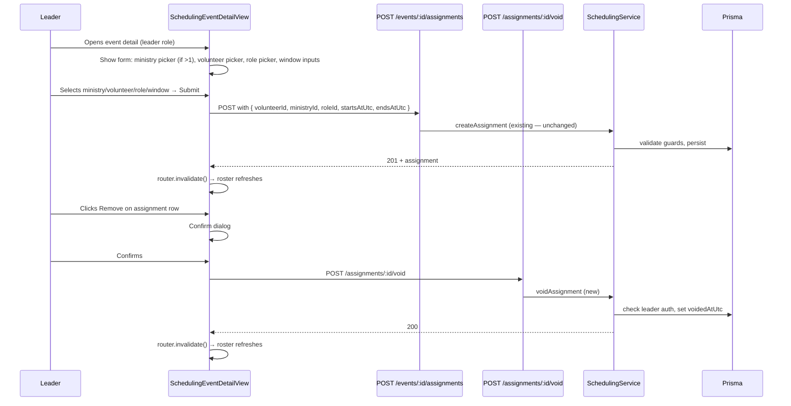

# Leader Production Roster Assignment UI — Design

**Spec**: `.specs/archive/features/leader-roster-assignment-ui/spec.md`  
**Status**: Design approved — ready for Tasks/Execute.  
**Requirements**: ROSTER-01–14

---

## Architecture Overview

Two changes are required: (1) a new API endpoint for leader-scoped assignment void, and (2) a replacement of the demo assignment form with production pickers backed by existing data-fetch helpers.



---

## Code Reuse Analysis

| Component | Location | How to reuse |
|-----------|----------|-------------|
| `fetchMinistryMemberships` | `apps/web/src/organization/fetchMinistryMemberships.ts` | Load Active members for volunteer picker; filter by `status === 'ACTIVE'` |
| `GET /ministries/:ministryId/roles` | `apps/api/src/organization/roles.controller.ts` | Fetch non-retired roles for role picker; filter client-side by `!role.retiredAt` (or server returns non-retired only — check existing behavior) |
| `ministriesForWritePickers` | `apps/web/src/organization/ministryArchive.ts` | Already filters archived ministries; reuse for ministry picker in Public Events |
| `createAssignment` | `apps/web/src/events/createAssignment.ts` | Unchanged — pass real IDs instead of demo env vars |
| `DestructiveConfirmDialog` | `apps/web/src/components/DestructiveConfirmDialog.tsx` | Reuse for Remove confirm (same pattern as Cancel event) |
| `useToasts` | `apps/web/src/feedback/ToastHost.tsx` | Success toast after assignment or void |
| `assertLeaderCanActOnMinistry` | `AuthenticatedRequestContext` (API) | Already used in `createAssignment`; new `voidAssignment` uses the same guard |
| `assertSchedulingWriteAllowed` | `apps/api/src/scheduling/scheduling-write-guard.ts` | System Admin read-only guard; reuse in `voidAssignment` |

---

## API Design

### New endpoint: void assignment (leader/admin-scoped)

`POST /assignments/:assignmentId/void`

**Auth**: The caller must be either:
- A **Leader** of the **Ministry** the assignment belongs to (`assertLeaderCanActOnMinistry(assignment.ministryId)`), OR
- An **Admin** accredited for the **Church** that owns the event (`assertAdminAccreditedForChurch(assignment.event.churchId)`)

**Body**: none

**Response** `200`:

```json
{
  "id": "cuid",
  "voidedAtUtc": "2026-06-10T15:00:00.000Z"
}
```

**Error codes**:

| Code | HTTP | When |
|------|------|------|
| `ASSIGNMENT_NOT_FOUND` | 404 | Assignment ID does not exist |
| `ASSIGNMENT_ALREADY_VOIDED` | 400 | Assignment already voided |
| `LEADER_NOT_ASSIGNED` | 403 | Caller is not leader of that ministry and not accredited admin |
| `SYSTEM_ADMIN_READ_ONLY` | 403 | System Admin attempts write |

**Service method**: `SchedulingService.voidAssignment(input: { assignmentId, auth })`:

1. `assertSchedulingWriteAllowed(auth)` — blocks System Admin writes.
2. Load assignment with `ministryId` and `event.churchId`; 404 if missing.
3. Try `auth.assertLeaderCanActOnMinistry(assignment.ministryId)` — if ForbiddenException, try `auth.assertAdminAccreditedForChurch(event.churchId)` — if both fail, re-throw `LEADER_NOT_ASSIGNED`.
4. If `assignment.voidedAtUtc !== null` → throw `ASSIGNMENT_ALREADY_VOIDED`.
5. `prisma.assignment.update({ voidedAtUtc: clock.now() })`.
6. Return DTO.

**Controller**: add to `AssignmentsController`:

```typescript
@Post('assignments/:assignmentId/void')
@HttpCode(HttpStatus.OK)
voidAssignment(
  @Param('assignmentId') assignmentId: string,
  @AuthContext() auth: AuthenticatedRequestContext,
) {
  return this.scheduling.voidAssignment({ assignmentId, auth });
}
```

**Note**: No unavailability offer triggered on leader void (contrast with volunteer `release` which offers to add Unavailability). Volunteer is not consulted on leader-initiated void. Decision locked 2026-06-06 (ROSTER-A3, user-confirmed). See spec.md Decisions section.

---

## Web Design

### Volunteer picker data

Fetch `fetchMinistryMemberships({ ministryId, actingVolunteerId })` and filter by `status === 'ACTIVE'`. This reuses the existing fetch helper from the volunteers page — no new API endpoint needed.

Display: `{volunteer.displayName}` in the select option. If the membership list is empty after filtering, show a disabled picker with help text pointing to `/volunteers` to add members first.

### Role picker data

Fetch `GET /ministries/:ministryId/roles` (new client function `fetchMinistryRoles`). Filter client-side: `roles.filter(r => !r.retiredAt)`. Display `role.name` in the select option.

### Ministry picker (Public Events)

Use `ministriesForWritePickers(activeChurch?.ministries.filter(m => m.isLeader) ?? [])`. Auto-bind if exactly one ministry; show select if multiple. `ministryId` drives the volunteer and role pickers (both re-fetch on ministry change).

### Assignment form placement

Replace the `{canAssign ? <form …> : null}` block in `SchedulingEventDetailView`:

- New gate: `isLeader` on at least one ministry in the church AND event is not cancelled.
- For `PRIVATE` events: show form only if `data.ministry?.id` is a ministry the user leads.
- For `PUBLIC` events: show ministry picker first, then volunteer/role/window.

Keep the existing time window inputs (`startsAtUtc`, `endsAtUtc`) — default to the event window start+1h / end (existing `defaultAssignmentWindow` helper, unchanged).

### Remove action on roster rows

In the roster table, each row gains a "Remove" button visible only when:
- `isLeaderForMinistry(row.ministry.id)` or `isAccreditedAdmin`
- `row.voidedAtUtc === null` (already non-voided — voided rows should not appear in the active roster)

The remove button opens a `DestructiveConfirmDialog`. On confirm → `POST /assignments/:id/void` → `router.invalidate()`.

### Error mapping (web)

| API code | User message key |
|----------|-----------------|
| `UNAVAILABILITY_BLOCKS_ASSIGN` | `scheduling.detail.errors.unavailabilityBlocksAssign` (existing) |
| `ASSIGNMENT_OVERLAP` | `scheduling.detail.errors.assignmentOverlap` |
| `OUTSIDE_EVENT_WINDOW` | `scheduling.detail.errors.outsideEventWindow` |
| `MINISTRY_ARCHIVED` | `scheduling.detail.errors.ministryArchived` |
| `LEADER_NOT_ASSIGNED` | `scheduling.detail.errors.notLeader` |
| `ASSIGNMENT_ALREADY_VOIDED` | `scheduling.detail.errors.alreadyVoided` |

---

## Client Module

**New file**: `apps/web/src/events/voidAssignment.ts`

```typescript
export async function voidAssignment(input: {
  assignmentId: string;
  actingVolunteerId: string;
}): Promise<{ id: string; voidedAtUtc: string }>;
```

**New file**: `apps/web/src/organization/fetchMinistryRoles.ts`

```typescript
export async function fetchMinistryRoles(input: {
  ministryId: string;
  actingVolunteerId: string;
}): Promise<Array<{ id: string; name: string; retiredAt: string | null }>>;
```

Mirrors the pattern of `fetchMinistryMemberships.ts` and other API helpers (`GET /ministries/:id/roles` already exists).

---

## Testing Strategy

| Layer | File | Covers |
|-------|------|--------|
| API e2e | `apps/api/test/leader-roster-assignment.e2e-spec.ts` | Leader creates assignment via real data; leader voids other volunteer's assignment; non-leader void rejected; System Admin void rejected; already-voided re-void rejected |
| Web behavior | `apps/web/src/routes/schedulingEventDetail.behavior.test.tsx` (extend existing) | Form visible for leader, hidden for non-leader; volunteer picker shows only Active members; remove button + confirm dialog; demo gate removed |
| Web behavior | `apps/web/src/organization/fetchMinistryRoles.behavior.test.tsx` (new) | Roles fetch + filter retiredAt |

Gate: `pnpm test` (API + web Vitest).

---

## Requirement Mapping

| ID | Design section |
|----|----------------|
| ROSTER-01 | Form gate: `isLeader` check replacing demo env vars |
| ROSTER-02 | Volunteer picker: `fetchMinistryMemberships` + Active filter |
| ROSTER-03 | Ministry picker: `ministriesForWritePickers` + isLeader filter |
| ROSTER-04 | Role picker: `fetchMinistryRoles` + retiredAt filter |
| ROSTER-05 | Submit → `createAssignment` → `router.invalidate()` |
| ROSTER-06 | Error mapping table |
| ROSTER-07 | Form gate condition |
| ROSTER-08 | Remove button visibility condition |
| ROSTER-09 | `DestructiveConfirmDialog` before void |
| ROSTER-10 | `POST /assignments/:id/void` endpoint |
| ROSTER-11 | Auth: `assertLeaderCanActOnMinistry` or `assertAdminAccreditedForChurch` |
| ROSTER-12 | Voided assignment row excluded from roster table (existing filter) |
| ROSTER-13 | Remove `canAssign` / `VITE_DEMO_*` block |
| ROSTER-14 | No degradation without demo env vars |
