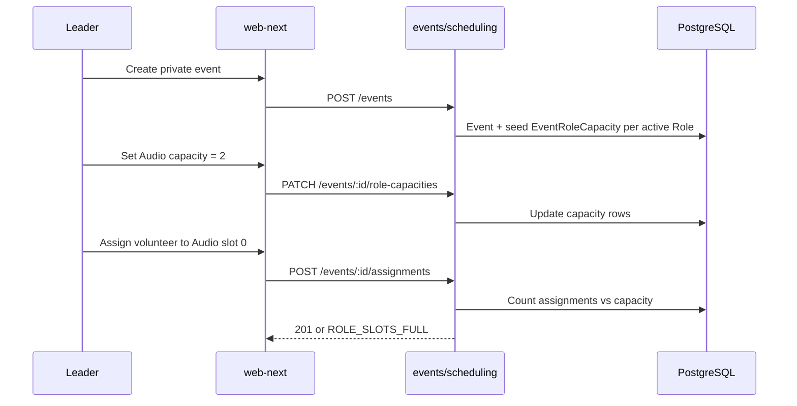

# Role slot capacity per event — Design

**Spec**: [spec.md](./spec.md)  
**Decisions**: [context.md](./context.md)  
**Status**: Design complete (2026-06-27) — ready for Execute (T01–T09)

---

## Architecture overview

Introduce **EventRoleCapacity** as the authoritative slot count per `(event, ministry, role)`. **Assignments** remain one volunteer per row; multiple rows may share the same `roleId` up to `capacity`. UI derives **slotIndex** for display and busy keys — not stored in DB.



---

## Code reuse

| Component | Location | Use |
|-----------|----------|-----|
| Private event create | `apps/api/src/events/events.service.ts` | Hook seed capacities after event insert |
| Event detail read | `apps/api/src/events/events.service.ts` `getEventDetail` | Include `roleCapacities[]` |
| Assignment create | `apps/api/src/scheduling/scheduling.service.ts` | Add capacity + duplicate-volunteer checks before `create` |
| Pure guards | `apps/api/src/scheduling/scheduling-rules.ts` | `assertRoleSlotAvailable`, unit tests |
| Leader auth | `AuthenticatedRequestContext.assertLeaderCanActOnMinistry` | PATCH + assign unchanged |
| Roster UI | `apps/web-next/src/leader/buildRosterRows.ts`, `RosterByEventSection.tsx` | Expand rows by capacity |
| Fill counts | `apps/web-next/src/leader/buildRosterRows.ts` `rosterFillCounts` | `total` = sum of capacities |
| i18n errors | `apps/web-next/src/i18n/locales/*/scheduling.json` | New error code keys |

---

## Data model

### Prisma addition

```prisma
model EventRoleCapacity {
  id         String       @id @default(cuid())
  eventId    String
  ministryId String
  roleId     String
  capacity   Int          @default(1)
  event      Event        @relation(fields: [eventId], references: [id], onDelete: Cascade)
  ministry   Ministry     @relation(fields: [ministryId], references: [id], onDelete: Cascade)
  role       MinistryRole @relation(fields: [roleId], references: [id], onDelete: Cascade)

  @@unique([eventId, ministryId, roleId])
  @@index([eventId, ministryId])
}
```

Add reverse relations on `Event`, `Ministry`, `MinistryRole`.

**No change** to `Assignment` schema — no `slotIndex` column.

### P2 optional

```prisma
// MinistryRole
defaultCapacity Int @default(1)
```

Used only when seeding new private events.

### Migration backfill

For existing private events with assignments:

```sql
-- Per (eventId, ministryId, roleId): capacity = GREATEST(1, COUNT(active assignments))
```

Insert missing rows for active roles with capacity 1. Document in migration README comment.

---

## Slot assignment algorithm (UI)

**Input:** `roles[]`, `roleCapacities[]`, `assignments[]` (non-voided, filtered by ministry)

**For each active role:**

1. `capacity = roleCapacities.find(...)?.capacity ?? 1`
2. `roleAssignments = assignments.filter(a => a.role.id === role.id).sort(by startsAtUtc, id)`
3. Emit `capacity` rows:
   - `slotIndex` 0..capacity−1
   - `slotKey = `${eventId}:${roleId}:${slotIndex}``
   - If `roleAssignments[slotIndex]` exists → filled row with assignmentId
   - Else → unfilled row

**Fill badge:** `filled = rows with volunteerName`, `total = sum(capacity per role)`.

---

## API design

### Seed on private event create

In `EventsService.create` (or equivalent), after event persisted:

- Load `MinistryRole` where `ministryId = event.ministryId` and `retired = false`
- `createMany` `EventRoleCapacity` with `capacity: role.defaultCapacity ?? 1` (P2) or `1` (v1)

### PATCH role capacities

`PATCH /events/:eventId/role-capacities`

**Routing:** Add a **separate** handler in `EventsController` — e.g. `@Patch(':id/role-capacities')` — not an overload of the existing `@Patch(':id')` `editEvent` route. Nest matches more-specific paths first, but a dedicated sub-route keeps edit vs capacity concerns separated (same pattern as `@Post(':id/cancel')`).

**Auth:** Leader of `ministryId` in body/query or Admin accredited for event's church.

**Body:**

```json
{
  "ministryId": "cuid",
  "capacities": [
    { "roleId": "cuid", "capacity": 2 },
    { "roleId": "cuid2", "capacity": 1 }
  ]
}
```

**Validation:**

- Event exists, not cancelled; private event `ministryId` must match event owner ministry
- Each `roleId` belongs to `ministryId`
- `capacity >= 1`
- `capacity >= count(active assignments for that role on event)` else `CAPACITY_BELOW_FILLED_SLOTS`

**Response:** `200` with updated `roleCapacities[]`.

### Event detail extension

Add to existing event detail DTO:

```json
{
  "roleCapacities": [
    { "roleId": "cuid", "capacity": 2 }
  ]
}
```

Scoped to ministry when leader reads (same as assignments filter today).

### Assignment create guards

Before `prisma.assignment.create`:

1. Load `EventRoleCapacity` for `(eventId, ministryId, roleId)` — if missing, treat `capacity = 1` (public events v1)
2. Count active assignments same triple — if `>= capacity` → `ROLE_SLOTS_FULL`
3. If volunteer already assigned same triple → `VOLUNTEER_ALREADY_ON_ROLE_SLOT`

Extend `validateAssignmentGuards` input or parallel check in service; add `scheduling-rules.test.ts` cases.

### Error codes (stable)

| Code | HTTP |
|------|------|
| `ROLE_SLOTS_FULL` | 400 |
| `VOLUNTEER_ALREADY_ON_ROLE_SLOT` | 400 |
| `CAPACITY_BELOW_FILLED_SLOTS` | 400 |
| `INVALID_ROLE_CAPACITY` | 400 (capacity < 1) |

---

## web-next changes

| File | Change |
|------|--------|
| `eventDetailPayload.ts` | `roleCapacities` type |
| `leader/types.ts` | `RosterRow.slotIndex`, `slotKey` |
| `buildRosterRows.ts` | Slot expansion algorithm |
| `RosterByEventSection.tsx` | Replace `rosterRoleKey` with `slotKey` for row `key` and busy state; optional multi-slot label |
| `schedulingEventDetail.tsx` | Capacity editor section + assign targets slot |
| `LeaderSchedulingPage.tsx` | Replace `rosterRoleKey` with `slotKey` for assign busy keys; `countOpenSlotsAcrossRosters` uses slot totals |
| `assignMutation.ts` | No API change — still `roleId`; slot is UI-only for targeting unfilled row |
| `i18n/locales/*/scheduling.json` | Error strings + capacity editor labels |

**Serve Well:** Capacity editor MAY reuse dialog/stepper patterns from `design-reference/serve-well/src/components/onda/modals.tsx` — wiring only to PATCH endpoint.

---

## Public events (v1 behavior)

- No `EventRoleCapacity` rows created on public event create.
- Roster for a ministry on a public event: **implicit capacity 1** per active role (current behavior).
- Phase 2: seed capacities per ministry when admin creates public event or first leader opens roster.

Document in spec/context — not blocking v1.

---

## Risks & Concerns

| Risk | Mitigation |
|------|------------|
| Hidden duplicate assignments today | Backfill migration + guards prevent new duplicates |
| Race: two simultaneous assigns fill last slot | Accept occasional `ROLE_SLOTS_FULL` on second request; no distributed lock v1 |
| `buildRosterRows` regression | Unit tests with capacity 2, 0 assignments, 1 assignment, 2 assignments |
| Public event gap | Explicit v1 implicit capacity 1; track phase 2 issue |
| Reduce capacity UX | Reject only; leader releases volunteers first |
| Cross-ministry double-book unchanged | Same volunteer may hold two roles same event if windows overlap — document in context |

---

## Verification strategy

- **API unit:** `scheduling-rules.test.ts` for capacity and duplicate volunteer
- **API e2e:** `events.e2e-spec.ts` or `leader-roster-assignment.e2e-spec.ts` multi-slot flow
- **web-next unit:** `leaderQueries.test.ts`, `RosterByEventSection.behavior.test.tsx`
- **Playwright:** `scheduling-event-detail.spec.ts` — 2× Audio, badge `2/2`
- **TLC Verifier:** Discrimination sensor on `buildRosterRows` (mutant using `.find()` must fail tests)

---

## CONTEXT.md glossary (T09)

**Role slot:** One of N roster positions for a catalog **Role** on a specific **Event**, where N = `EventRoleCapacity.capacity`. Distinct from **Role** (catalog name) and **Assignment** (a volunteer's commitment filling one slot).
