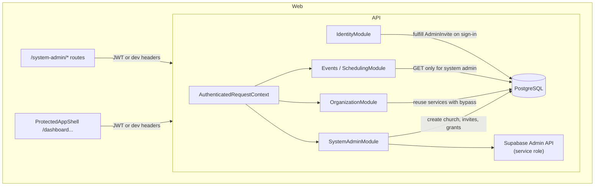

# System Admin Platform Design

**Spec**: `.specs/archive/features/system-admin-platform/spec.md`  
**Status**: Approved for Tasks / Execute  
**ADR**: [`docs/adr/0005-system-admin-operator-role.md`](../../../docs/adr/0005-system-admin-operator-role.md) (T-SYS-01)

---

## Architecture Overview

Introduce a **platform operator** layer above church-scoped **Admin** stewardship. **System Admin** is a grant on an existing **Volunteer** row (seed-only in v1). Operator APIs live under a dedicated Nest module and web route tree; church volunteers continue using `ProtectedAppShell` unchanged.



---

## Design decisions (Specify open questions resolved)

| Question | Decision |
|----------|----------|
| Pending invite state | **`AdminInvite` Prisma table** — auditable, idempotent fulfillment, survives Supabase-only retries |
| P5 read routes | **Reuse existing scheduling GET handlers** with `assertSystemAdmin()` visibility bypass; **no** duplicate read DTOs |
| P5 writes | Central **`assertSchedulingWriteAllowed(auth)`** — rejects when caller is System Admin (`SYSTEM_ADMIN_READ_ONLY`) |
| Existing **Volunteer** invited | **Add `AdminAccreditation`** for target **Church**; do not create duplicate **Volunteer** |
| Email already linked, no profile | **Fulfill on first JWT sign-in** using `email` claim + pending invite |
| Revoke last church **Admin** | **Block** with `LAST_ADMIN_ACCREDITATION` (System Admin must grant replacement first) |
| Supabase invite | **`auth.admin.inviteUserByEmail`** via `@supabase/supabase-js` + **`SUPABASE_SERVICE_ROLE_KEY`** (API only) |
| Redirect after invite | `http://localhost:5173/dashboard` (local); document prod URL in runbook |
| Dev / e2e | Extend dev headers: operator uses seeded `seed-volunteer-system-admin`; e2e mocks Supabase invite client |

---

## Data model

### `SystemAdministrator`

| Field | Type | Notes |
|-------|------|--------|
| `volunteerId` | PK, FK → `Volunteer` | One row = platform operator |
| `createdAt` | `DateTime` | Audit |

- Created **only** in `prisma/seed.ts` (and tests).
- No API to grant/revoke System Admin in v1.

### `AdminInvite`

| Field | Type | Notes |
|-------|------|--------|
| `id` | cuid | |
| `email` | `String` | Normalized lowercase |
| `churchId` | FK → `Church` | |
| `status` | enum `PENDING` \| `FULFILLED` \| `REVOKED` | |
| `invitedByVolunteerId` | FK → `Volunteer` | System Admin who sent |
| `fulfilledVolunteerId` | FK?, nullable | Set on fulfillment |
| `createdAt` / `fulfilledAt` | `DateTime` | |

- Unique partial index: one `PENDING` invite per `(email, churchId)` (application-enforced + migration unique where status=PENDING if feasible; else service check).

### Church bootstrap (P2)

`POST /system-admin/churches` body:

```ts
{
  name: string;
  defaultTimezone: string; // IANA, validate with same helper as elsewhere
  campus?: { name?: string; timezone?: string }; // default name "Principal", campus timezone = church default
}
```

Transaction: `Church` → default `Campus` → optional empty ministries list (none required at create).

---

## Auth and request context

### Extend `AuthenticatedRequestContext`

```ts
assertSystemAdmin(): Promise<Volunteer>;
isSystemAdmin(): Promise<boolean>;
```

- `AuthContextResolverService` loads `SystemAdministrator` once per request (memoized with volunteer).
- **403** `NOT_SYSTEM_ADMIN` when assert fails.

### Extend `GET /identity/me`

```ts
{
  volunteer: { ... },
  authSubjectId: string | null,
  isSystemAdmin: boolean,
}
```

Web uses `isSystemAdmin` for route guard and nav entry (operator link hidden for others).

### JWT verifier

Extend `VerifiedAccessToken` with optional `email?: string` from Supabase JWT payload for invite fulfillment.

### Dev headers

When `AUTH_ALLOW_DEV_HEADERS=true`, `X-System-Admin: true` is **not** used alone — still require `X-Volunteer-Id` of a seeded System Admin volunteer (prevents arbitrary elevation). Document in `docs/runbooks/api-auth-context.md`.

---

## API surface (`SystemAdminModule`)

Prefix: **`/system-admin`**. All routes call `auth.assertSystemAdmin()` first.

| Method | Path | Story | Behavior |
|--------|------|-------|----------|
| `POST` | `/churches` | P2 | Create church + campus |
| `GET` | `/churches` | P2 | List all churches (paginated `?q=&limit=&cursor=`) |
| `POST` | `/churches/:churchId/admin-invites` | P3 | `{ email }` → Supabase invite + `AdminInvite` PENDING |
| `GET` | `/volunteers` | P4 | Search by name/email fragment; include accreditations, leaderships, membership summary |
| `GET` | `/volunteers/:volunteerId` | P4 | Detail for stewardship UI |
| `PUT` | `/volunteers/:volunteerId/churches/:churchId/admin-accreditation` | P4 | Grant accreditation (idempotent) |
| `DELETE` | `/volunteers/:volunteerId/churches/:churchId/admin-accreditation` | P4 | Revoke; block if last admin |
| `POST` | `/ministries/:ministryId/leaders` | P4 | Delegate to existing #47 command |
| `DELETE` | `/ministries/:ministryId/leaders/:volunteerId` | P4 | Delegate to #47 |
| `POST` | `/ministries/:ministryId/memberships` | P4 | Delegate to #46 |
| `PATCH` | `/ministries/:ministryId/memberships/:volunteerId` | P4 | Delegate to #46 |

**Scheduling (P5)** — no new paths:

- Reuse `GET /events`, `GET /events/:id`, roster read endpoints.
- In `EventsService` / `StewardshipService`: if `await auth.isSystemAdmin()`, treat as cross-church read (filter optional `?churchId=`).
- All scheduling **write** entry points call `assertSchedulingWriteAllowed` early.

Stable error codes: `NOT_SYSTEM_ADMIN`, `SYSTEM_ADMIN_READ_ONLY`, `LAST_ADMIN_ACCREDITATION`, `ADMIN_INVITE_INVALID`, `ADMIN_INVITE_ALREADY_PENDING`.

---

## Invite fulfillment (P3)

**`AdminInviteService.fulfillPendingInvites(volunteer, email)`** called from `IdentityService.resolveVolunteer` after JWT verified and volunteer resolved (or before throw on `PROFILE_NOT_LINKED`):

1. Normalize email; find `AdminInvite` where `status = PENDING` and `email` matches.
2. If no volunteer yet: create `Volunteer` (`displayName` from email local-part), set `authSubjectId` from JWT `sub`.
3. If volunteer exists: ensure `authSubjectId` set (same sub).
4. `AdminAccreditation.upsert` for invite `churchId`.
5. Mark invite `FULFILLED`.

If multiple pending invites for same email (different churches): fulfill **all** on first sign-in.

**Supabase**: `SupabaseAdminService.inviteUserByEmail(email, { redirectTo })` — no-op stub when `SUPABASE_SERVICE_ROLE_KEY` unset (local dev may use manual link runbook; tests inject mock).

---

## Web (`apps/web`)

### Route tree

- Parent: `/system-admin` under `rootRoute` (sibling to shell, **not** inside `ProtectedAppShell`).
- Layout: `SystemAdminShell` — minimal HOPE chrome, no church/campus switcher.
- Child routes:
  - `/system-admin` — dashboard links
  - `/system-admin/churches` — list + create form
  - `/system-admin/churches/:churchId` — detail + invite Admin form
  - `/system-admin/users` — search
  - `/system-admin/users/:volunteerId` — grants editor
  - `/system-admin/scheduling` — read-only event list (reuses scheduling API client with church filter)

### Guard

`beforeLoad`: fetch `identity/me`; if `!isSystemAdmin` → redirect `/dashboard` with toast.

### i18n

Namespaces: `systemAdmin.json` (en + pt-BR).

---

## Code reuse

| Existing | Reuse |
|----------|--------|
| `OrganizationService` | Ministry create, membership, leader delegation — add `systemAdminActor: true` internal flag or dedicated wrapper that skips `assertAdminAccreditedForChurch` |
| `StewardshipService` | Read filters; extend `canViewEvent` for system admin |
| `EventsService` | List/detail GET; guard writes |
| `AuthContext` decorator | All controllers |
| `church-ministries` patterns | Validation for timezone / names |
| `ProtectedAppShell` / `AuthSessionProvider` | Same session; operator uses normal sign-in |

---

## Documentation deliverables (Execute)

| Artifact | Content |
|----------|---------|
| **ADR 0005** | System Admin vs church Admin; seed-only grant; read-only scheduling; service role secrecy |
| **`CONTEXT.md`** | Glossary entry **System Admin** |
| **Platform PRD** | Remove “network-wide super Admin out of scope”; point to ADR |
| **`docs/runbooks/supabase-auth-local.md`** | Service role, invite redirect URLs, invite fulfillment |
| **`docs/runbooks/api-auth-context.md`** | `isSystemAdmin`, operator dev volunteer |

---

## Related slice: `CHURCH-META-01` (out of band)

Church-scoped **Admin** edits **Church** `name` + `defaultTimezone`:

- `PATCH /churches/:churchId` with `auth.assertAdminAccreditedForChurch(churchId)`.
- Web: settings section under existing shell (e.g. ministries or new organization settings).
- Tracked as **T-CHURCH-*** in `tasks.md`; not blocking System Admin P1–P5.

---

## Risks and mitigations

| Risk | Mitigation |
|------|------------|
| Service role key leaked | Server env only; never `VITE_*`; CI uses mock |
| Invite fulfillment race | DB transaction per email batch |
| System Admin reads PII | Paginated search; runbook notes operator policy |
| Bypass duplicates org rules | Delegate to OrganizationService, don’t fork voiding logic |
| E2e depends on Supabase | Mock `SupabaseAdminService` in Jest; optional manual HITL for real invite |

---

## Test strategy

| Layer | Scope |
|-------|--------|
| API Jest e2e | `apps/api/test/system-admin/*.e2e-spec.ts` — auth, church create, invite fulfill (mock Supabase), accreditation, scheduling read vs write denial |
| Web Vitest | `systemAdminShell.behavior.test.tsx`, page-level mocks |
| Playwright | Deferred to follow-up issue unless needed for invite HITL |

**Verify gate:** `pnpm test` (API e2e + web unit) per `AGENTS.md`.
