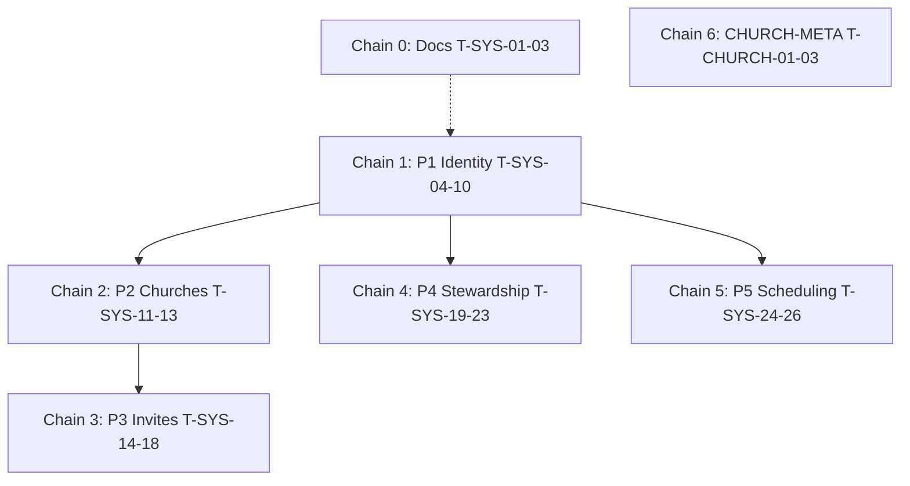

# System Admin Platform — Parallel Execution Guide

**Feature**: `.specs/archive/features/system-admin-platform/`  
**Tasks**: [`tasks.md`](tasks.md)  
**Design**: [`design.md`](design.md)

This document defines **execution chains**, **dependencies**, and **what can run in parallel**. Each chain maps to one GitHub issue (see [Tracker links](#tracker-links)).

---

## Chain overview

| Chain | GitHub issue | Tasks | Blocked by | Can parallel with |
|-------|--------------|-------|------------|-------------------|
| **0 — Documentation** | [#87](https://github.com/kairan/onda-volunteer/issues/87) | T-SYS-01 → 02 → 03 | — | — (02 ∥ 03 after 01) |
| **1 — Identity + shell (P1)** | [#88](https://github.com/kairan/onda-volunteer/issues/88) | T-SYS-04 → … → 09; T-SYS-10 [P] | #87 (soft) | #93 |
| **2 — Church provisioning (P2)** | [#89](https://github.com/kairan/onda-volunteer/issues/89) | T-SYS-11 → 12 → 13 | #88 | #91, #92, #93 |
| **3 — Admin invite (P3)** | [#90](https://github.com/kairan/onda-volunteer/issues/90) | T-SYS-14 → … → 18 | #88, #89 | #91, #92, #93 |
| **4 — User stewardship (P4)** | [#91](https://github.com/kairan/onda-volunteer/issues/91) | T-SYS-19 → … → 23 | #88 | #89, #90, #92, #93 |
| **5 — Scheduling read-only (P5)** | [#92](https://github.com/kairan/onda-volunteer/issues/92) | T-SYS-24 → 25 → 26 | #88 | #89, #90, #91, #93 |
| **6 — Church metadata (CHURCH-META)** | [#93](https://github.com/kairan/onda-volunteer/issues/93) | T-CHURCH-01 → 02 → 03 | — | **All chains** |

---

## Dependency diagram



**Legend:** Solid = hard dependency. Chain 6 has no dependency on System Admin.

---

## Within-chain parallelism

### Chain 0 — Documentation

```text
T-SYS-01 (ADR 0005)
    ├── T-SYS-02 (CONTEXT + PRD)  [P]
    └── T-SYS-03 (runbooks)       [P]
```

### Chain 1 — Identity + shell

```text
T-SYS-04 → T-SYS-05 → T-SYS-06 → T-SYS-07
                                    ├── T-SYS-08 → T-SYS-09
                                    └── T-SYS-10 [P] web shell (after 07)
```

`T-SYS-10` does **not** require T-SYS-08/09 (only `isSystemAdmin` on `identity/me`).

### Chains 2–5 — API vs web

| After API task | Web task [P] (parallel) |
|----------------|-------------------------|
| T-SYS-12 | T-SYS-13 |
| T-SYS-17 | T-SYS-18 |
| T-SYS-22 | T-SYS-23 |
| T-SYS-25 | T-SYS-26 |

### Chain 6 — Church metadata

```text
T-CHURCH-01 → T-CHURCH-02
                  └── T-CHURCH-03 [P] web
```

Uses **church-scoped Admin** only — no System Admin code required.

---

## Cross-chain parallel plan (after Chain 1 merges)

When **Chain 1** is complete (`T-SYS-09` green), start up to **three API tracks** plus **Chain 6**:

| Agent / PR | Chain | Tasks |
|------------|-------|-------|
| A | 2 → 3 | Churches, then invites |
| B | 4 | Stewardship |
| C | 5 | Scheduling read-only |
| D | 6 | Church metadata (anytime) |

**Do not** start Chain 3 until Chain 2 has `POST /system-admin/churches`.

**Avoid** two open PRs each adding a Prisma migration without rebasing.

---

## Verify gates (all chains)

| Scope | Command |
|-------|---------|
| API e2e | `export DATABASE_URL=...` then `pnpm --filter @onda/api test` |
| Web unit | `pnpm --filter @onda/web test` |
| Full repo | `pnpm test` |

---

## Requirement traceability

| Requirement | Chain |
|-------------|-------|
| SYSADM-01 | 0, 1 |
| SYSADM-02 | 2 |
| SYSADM-03 | 3 |
| SYSADM-04 | 4 |
| SYSADM-05 | 5 |
| CHURCH-META-01 | 6 |

---

## Tracker links

| Chain | Issue | Spec |
|-------|-------|------|
| 0 — Documentation | [#87](https://github.com/kairan/onda-volunteer/issues/87) | `docs/issues/87-system-admin-chain-0-documentation.md` |
| 1 — P1 Identity + shell | [#88](https://github.com/kairan/onda-volunteer/issues/88) | `docs/issues/88-system-admin-chain-1-identity-shell.md` |
| 2 — P2 Churches | [#89](https://github.com/kairan/onda-volunteer/issues/89) | `docs/issues/89-system-admin-chain-2-church-provisioning.md` |
| 3 — P3 Admin invite | [#90](https://github.com/kairan/onda-volunteer/issues/90) | `docs/issues/90-system-admin-chain-3-admin-invite.md` |
| 4 — P4 Stewardship | [#91](https://github.com/kairan/onda-volunteer/issues/91) | `docs/issues/91-system-admin-chain-4-stewardship.md` |
| 5 — P5 Scheduling read-only | [#92](https://github.com/kairan/onda-volunteer/issues/92) | `docs/issues/92-system-admin-chain-5-scheduling-readonly.md` |
| 6 — CHURCH-META | [#93](https://github.com/kairan/onda-volunteer/issues/93) | `docs/issues/93-church-admin-church-metadata.md` |
