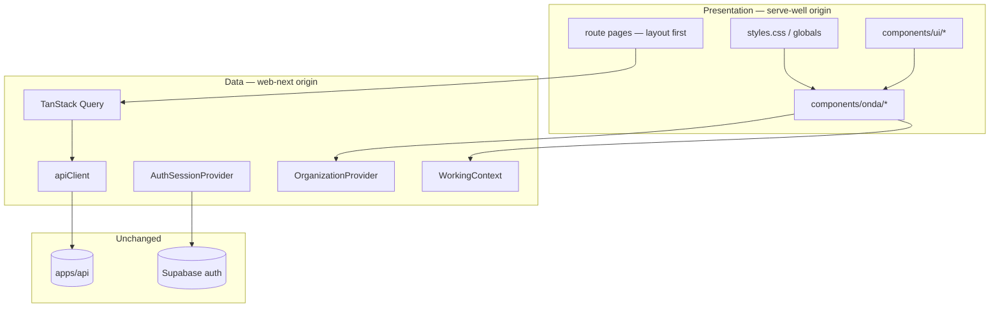

# Frontend restart — serve-well + API — Design

**Status:** Design locked — Execute Phase 5 cutover pending (#175, T17)  
**Spec:** [spec.md](./spec.md)  
**Decisions:** [context.md](./context.md)

---

## 1. Architecture



**Rule:** No route file imports mock arrays. Presentation components receive props from hooks (`useQuery`) at route boundary.

---

## 2. Package layout

```
apps/web-onda/
├── package.json              # @onda/web-onda
├── vite.config.ts            # port e.g. 5175
├── src/
│   ├── main.tsx
│   ├── router.tsx
│   ├── routes/               # TanStack file routes
│   ├── components/
│   │   ├── onda/             # FROM serve-well (AppShell, dashboards, modals…)
│   │   └── ui/               # FROM serve-well shadcn
│   ├── shell/                # Thin adapters: org controls, working context picker
│   ├── api/                  # FROM web-next
│   ├── auth/                 # FROM web-next
│   ├── query/                # FROM web-next
│   ├── organization/         # FROM web-next + workingContext.ts
│   ├── leader/               # FROM web-next
│   ├── volunteer/            # FROM web-next
│   ├── i18n/                 # FROM web-next
│   ├── system-admin/         # FROM web-next (later phase)
│   ├── settings/             # LocalTimeProvider from web-next
│   └── styles/
│       └── globals.css       # FROM serve-well styles.css (fonts fixed)
```

---

## 3. Stack mapping

| serve-well (Lovable) | web-onda |
|----------------------|----------|
| TanStack Start + `server.ts` | Vite SPA `index.html` + `main.tsx` |
| Bun | pnpm |
| `@lovable.dev/vite-tanstack-config` | `@vitejs/plugin-react` + `@tailwindcss/vite` |
| `createFileRoute` in `src/routes/` | Same — TanStack Router file routing |
| Supabase as only backend | Supabase auth + `VITE_API_URL` REST |
| `integrations/supabase/types` empty | No generated DB types in frontend |

---

## 4. serve-well → production adaptations

### AppShell.tsx

| serve-well | web-onda |
|------------|----------|
| `useRole()` + role `<Select>` | **Remove** |
| `CampusSwitcher` mock | `OrganizationContextControls` + real churches |
| Global search `<Input>` | **Remove** |
| `useAuth` + `signOut` | Port from web-next `AuthSessionProvider` |
| `AppSidebar` static `navByRole` | `buildNavForWorkingContext(workingContext)` |

### AppSidebar.tsx

| serve-well | web-onda |
|------------|----------|
| `navByRole[role]` | Nav manifest from active working context + org admin grants |
| Hardcoded "Grace Chapel" | `activeChurch.name` |
| Wordmark "Onda" | i18n / fixed brand per ADR 0006 |

### Dashboards

Split serve-well `VolunteerDashboard` into route-mounted sections:

```
serve-well VolunteerDashboard          →  web-onda routes
─────────────────────────────────────────────────────────
Hi Maria + summary                     →  /dashboard
WeekTimeline                             →  /dashboard (phase 2+ or defer)
Assignment cards grid                  →  /scheduling (volunteer)
Time away list + dialogs               →  /dashboard preview + /time-away full
```

Leader: `MinistryLeaderDashboard` → `LeaderSchedulingPage` layout replacement (same components, real `RosterByEventSection` data).

### modals.tsx

Keep dialog **structure** from serve-well; replace `toast.success` stubs with `useMutation` + `toastOrchestrator` / Query invalidation.

---

## 5. Working context (Foundation)

Implement per [working-context-picker/design.md](../working-context-picker/design.md):

- `buildWorkingContextOptions`, `resolveWorkingContext`
- Picker in shell (sidebar): **Atuar como**
- `useApiScope()` for `X-Leader-Ministry-Id`
- `buildNavForWorkingContext` replaces grant-only nav for mode selection

---

## 6. Route tree (v1 target)

Align with `apps/web` for cutover parity (RST-IA-01 visual composition may differ per screen):

```
/auth
/dashboard
/scheduling
/scheduling/events/$eventId
/scheduling/events/new
/scheduling/events/new-private
/time-away
/leader/volunteer-time-away
/ministries
/volunteers
/ministry-leaders
/system-admin/*
```

Router file names can mirror `web-next/src/router.tsx` — **page components** are serve-well layouts.

> **Parity notes (T07):** `apps/web-next/src/router.tsx` is the mechanical source for protected paths. Gaps vs this list — resolve in T07 scaffold / `router.test.ts`:
>
> - `/auth` — **not** in `web-next` today; auth entry is legacy `/` + `AuthPanel`. serve-well uses `/auth`; add explicit route at T07 (Supabase callback entry).
> - `/events/$eventId` — legacy redirect to `/scheduling/events/$eventId` per [ADR 0004](../../../docs/adr/0004-retire-legacy-event-detail-route.md); include in T07.
> - `/user-select` — dev-only persona switcher (`devUserSelectAvailable`); include for local dev parity with `web-next`, not production cutover checklist.

---

## 7. Migration from web-next (mechanical)

1. `cp -r apps/web-next/src/{api,auth,query,organization,leader,volunteer,i18n,settings} apps/web-onda/src/`
2. Add `organization/workingContext.ts` (+ tests)
3. `cp -r design-reference/serve-well/src/components/{onda,ui} apps/web-onda/src/components/`
4. Port `styles.css` → `styles/globals.css`; fix `@source`, font paths
5. Rewrite `shell/` and `routes/` — do **not** copy `web-next` shell/routes

---

## 8. CI / workspace

```json
// package.json name
"@onda/web-onda"

// root package.json scripts
"dev:web-onda": "pnpm --filter @onda/web-onda dev"
```

Extend `.github/workflows/ci.yml` with `@onda/web-onda` filter (clone web-next job matrix).

---

## 9. Visual acceptance checklist

Before RST-CUT-01 sign-off, compare at **1440px**:

- [ ] Shell: sidebar width, top bar blur, Onda wordmark, church name
- [ ] Volunteer dashboard: greeting typography, card `shadow-card`, spacing `max-w-6xl`
- [ ] Assignment grid: 2 columns md+, badge tones (primary / amber gap)
- [ ] Leader roster: event card header `bg-muted/30`, fill badge, row actions
- [ ] Focus ring `#2034D6`
- [ ] pt-BR copy on primary flows

Reference screenshots: `design-reference/serve-well` local dev or lovable.app.

---

## 10. Risks

| Risk | Mitigation |
|------|------------|
| Duplicate third app in repo | Freeze `web-next` immediately; **delete `apps/web` + `apps/web-next` at T17** |
| serve-well components assume mock shape | Adapter props at route boundary; types from `volunteer/types`, `leader/types` |
| Font licensing Right Grotesk | Same note as ui-refresh — self-host or fallback Space Grotesk |
| Scope creep re-implementing web-next | Phase gates; volunteer+leader before admin |

---

## 11. Package lifecycle

| Package | Until cutover | At T17 (RST-CUT-01) |
|---------|---------------|---------------------|
| `apps/web` | Production deploy | **Deleted** from monorepo |
| `apps/web-next` | Frozen; salvage data layer only; no #148 | **Deleted** from monorepo |
| `apps/web-onda` | Built toward parity | **Sole** church-role frontend package |
| `design-reference/serve-well` | Read-only reference | Unchanged; not in CI |
