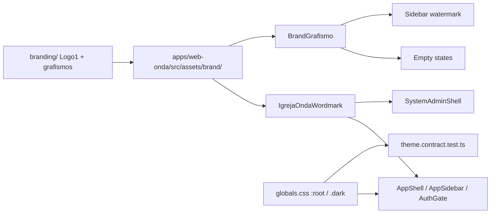

# Official BrandBook → web-onda — Design

**Spec**: [spec.md](./spec.md)  
**Context**: [context.md](./context.md)  
**Status**: Approved for Tasks (Specify confirmed 2026-07-16)  
**Amends**: ADR 0006 · target package `apps/web-onda` only  
**Blocks**: [#175](https://github.com/kairan/onda-volunteer/issues/175) cutover  
**Issue**: [#180](https://github.com/kairan/onda-volunteer/issues/180)

---

## Architecture Overview

Visual-only remapping inside the existing serve-well shell. No new routes, APIs, or IA changes.

**Approach (locked):** Token remapping + shared wordmark/grafismo components + Balanced flourishes on auth/empty/sidebar only. Not a shell rewrite.

---

## Token mapping (source of truth = BrandBook hex)

Execute converts to `oklch(...)` matching current `globals.css` style; theme contract locks the committed oklch strings. Hex below is normative.

| Role | Hex | CSS variable(s) |
|------|-----|-----------------|
| Page background | `#eeeee7` | `--background` |
| Primary text / deep | `#181e5f` | `--foreground`, `--card-foreground` |
| Near-black (optional emphasis) | `#161616` | reserved; prefer `#181e5f` for body |
| Primary action | `#2537de` | `--primary`, `--ring`, `--sidebar-primary`, `--brand` |
| Primary hover | `#1f2bc8` | `--primary-hover` |
| Primary on primary | `#ffffff` | `--primary-foreground` |
| Card / sidebar surface | `#ffffff` | `--card`, `--sidebar` |
| Border / input | `#9cc7e4` | `--border`, `--input`, `--sidebar-border` |
| Border strong / divider | `#b0d3e7` ok as softer alt; prefer `#9cc7e4` default | — |
| Muted panel / nav tint | `#e5f4fe` | `--muted`, `--sidebar-accent`, `--accent` |
| Muted text | `#365683` | `--muted-foreground` |
| Success (BrandBook) | `#79caab` | `--chart-4` / success semantic if present |
| Destructive | keep existing warm red oklch | `--destructive` — retune only if AA fails on `#eeeee7` |

**Dark (BB-DARK-01):** Keep structure of `.dark`; set `--primary` / `--ring` to a lighter BrandBook blue (e.g. `#537ae5` family) so controls stay visible; backgrounds stay deep navy (`#181e5f` / `#10175d` family). Exact oklch at Execute.

**Typography:** No CSS/font changes required beyond documenting SF Pro exclusion and ensuring `font-display` heroes stay uppercase (audit in flourish/docs tasks). Space Grotesk already covers captions.

---

## Components

### Brand assets folder

- **Location:** `apps/web-onda/src/assets/brand/`
- **Files (commit binary):**
  - `logo-igreja-onda-preto.png` ← Logo 1 PRETO
  - `logo-igreja-onda-branco.png` ← Logo 1 BRANCO
  - `grafismo-ondas-filled.png` ← GRAFISMO 3 (blue filled)
  - `grafismo-ondas-line.png` ← GRAFISMO 4 (line; light-bg watermark)
- **Source:** `/Users/kairan/workspace/branding/1. LOGO/IGREJA ONDA/` and `3. GRAFISMOS/`
- **Rule:** Do not commit SF Pro OTFs.

### `IgrejaOndaWordmark`

- **Purpose:** Official Logo 1 PNG with accessible name `igreja onda`.
- **Location:** `apps/web-onda/src/components/brand/IgrejaOndaWordmark.tsx`
- **Props:** `variant: 'preto' | 'branco'`; `className?`; optional `compact` for collapsed sidebar (object-fit crop / max-height).
- **Fallback:** If `onError`, render text `igreja onda` (not “Onda”).
- **Reuse:** Replace typed “Onda” in `AppSidebar`, `AppShell`, `ProtectedAppShell` `AuthGateLayout`, `routes/auth.tsx`, `SystemAdminShell`.

### `BrandGrafismo`

- **Purpose:** Support graphic for empty states / watermark (never as primary logo).
- **Location:** `apps/web-onda/src/components/brand/BrandGrafismo.tsx`
- **Props:** `variant: 'filled' | 'line'`; `opacity?`; `decorative` (default `true` → `aria-hidden`).

### Flourish placement

| Surface | Treatment |
|---------|-----------|
| `AuthGateLayout` + `/auth` | Full-bleed soft gradient (`#181e5f` → `#2537de` → `#eeeee7`); Logo 1 branco or preto for contrast; no glass on form card |
| Sidebar expanded | Logo 1 preto; optional low-opacity `grafismo-ondas-line` watermark behind nav |
| Sidebar collapsed | Compact wordmark or filled grafismo square — prefer **compact Logo 1 crop**, not a new mark |
| Empty states (volunteer assignments, leader events, time-away) | Small filled grafismo above copy |
| Sticky header | Keep/tune existing blur only |
| Cards / roster / tables | **No** glass |

---

## Code Reuse

| Existing | Use |
|----------|-----|
| `theme/theme.contract.test.ts` | Replace provisional oklch anchors; add SF Pro absence + asset existence |
| `shell/AppShell.behavior.test.tsx` | Assert logo `alt` / accessible name instead of text “Onda” |
| `components/onda/AppSidebar.tsx` | Wordmark + watermark |
| `ProtectedAppShell` `AuthGateLayout` | Gradient + wordmark |
| ADR 0006 / root `DESIGN_SYSTEM.md` historical banner | Amend ADR; point DESIGN_SYSTEM banner at amended ADR |

---

## Risks & Concerns

| Concern | Mitigation |
|---------|------------|
| PNG Logo 1 is palette (`P`) mode @ large resolution | Commit optimized copies if needed; `loading="eager"` in shell; contract test file exists |
| Watermark harming nav contrast | Cap opacity (≤0.08–0.12); AA check on nav labels |
| Provisional oklch still hardcoded in tests | Update contract in same task as CSS |
| Agents reintroduce typed “Onda” | Behavior tests + i18n `appName` may stay product name — **shell mark** must be logo; clarify in ADR that UI product strings ≠ wordmark |
| #175 races this feature | Spec blocks cutover; issue body + ROADMAP note |

---

## ADRs / project decisions

- **Conform** to AD-001 archive rules when feature ships.
- **Supersede** provisional palette bullets in ADR 0006 with official Brandbook 2027 table (amend in place with “Amended 2026-07-16” section — prefer amend over new ADR number unless conflict).
- Append **AD-NNN** in `.specs/project/STATE.md` when Execute completes: official BrandBook is source of truth for `web-onda` visuals.
