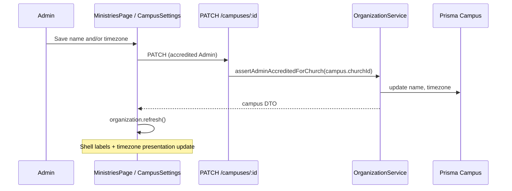
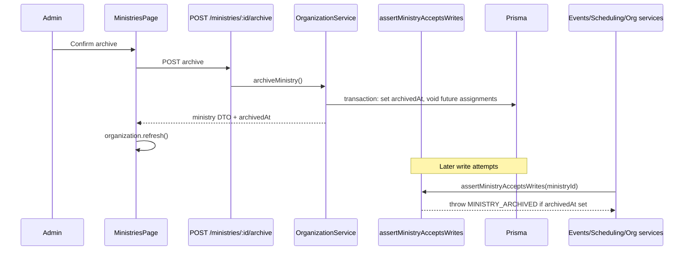

# Organization Structure Administration — Design

**Spec**: `.specs/features/organization-structure-administration/spec.md`  
**Status**: Approved — ORG-STRUCT-05 designed (Execute [#107](https://github.com/kairan/onda-volunteer/issues/107)); ORG-STRUCT-06 designed (Execute [#108](https://github.com/kairan/onda-volunteer/issues/108))  
**Requirements**: ORG-STRUCT-05 (campus metadata); ORG-STRUCT-06 (ministry archive)

---

## Architecture Overview

P1 shipped **Ministry** create/rename and **Church** metadata self-service (#93). P2 adds **Campus** rename and IANA timezone maintenance for accredited **Admins**, scoped to the **Campus**’s parent **Church** (tenant).

Canonical scheduling remains **UTC** on `Event`, `Assignment`, and `Unavailability`. For ministry operations, the **active Campus** timezone is the presentation anchor (e.g. **Campus Porto** for Portugal volunteers under church **Onda Dura**). **Church** `defaultTimezone` from #93 is organizational fallback only when no campus timezone applies in the resolver — P2 does **not** ask leaders to “change church timezone” to fix multi-campus locales. Existing web fallback: `activeCampus?.timezone ?? activeChurch?.defaultTimezone` (ADR 0001 — separate Church/Campus selectors).



**Ministry archive (ORG-STRUCT-06)** is specified in [§ Ministry archive](#ministry-archive-org-struct-06) below.

---

## Code Reuse Analysis

| Component | Location | How to use |
|-----------|----------|------------|
| Church metadata PATCH | `OrganizationService.updateChurchMetadata`, `ChurchesController` | Mirror auth, empty-body guard, `parseIanaTimezone` |
| IANA validation | `apps/api/src/common/iana-timezone.ts` | Reuse `parseIanaTimezone` for `timezone` field |
| Ministry rename | `OrganizationService.renameMinistry` | Mirror name trim/required pattern; optional per-church uniqueness (see Data) |
| Organization context | `OrganizationService.getAccessibleOrganizationContext` | Already returns `campuses[]` per church — no read-path change |
| Web settings UI | `ChurchSettingsSection.tsx`, `churchMetadata.ts` | Same section layout on `/ministries`, `refresh()` after save |
| Admin auth | `AuthenticatedRequestContext.assertAdminAccreditedForChurch` | Resolve `campus.churchId` before update |
| Error codes | Existing `ADMIN_NOT_ACCREDITED`, `INVALID_TIMEZONE` | Add `CAMPUS_*` codes aligned with church/ministry |

---

## API Design

### Endpoint

`PATCH /campuses/:campusId`

**Body** (at least one field required):

```json
{
  "name": "Zona Sul",
  "timezone": "America/Sao_Paulo"
}
```

**Response** `200`:

```json
{
  "id": "cuid",
  "churchId": "cuid",
  "name": "Zona Sul",
  "timezone": "America/Sao_Paulo"
}
```

**Controller**: `CampusesController` in `apps/api/src/organization/` (register in `organization.module.ts`).

**Service**: `OrganizationService.updateCampusMetadata({ campusId, name?, timezone?, auth })`:

1. Load campus with `churchId`; `404` + `CAMPUS_NOT_FOUND` if missing.
2. `await auth.assertAdminAccreditedForChurch(campus.churchId)`.
3. Validate `name` (trim, non-empty → `CAMPUS_NAME_REQUIRED`) when provided.
4. Validate `timezone` via `parseIanaTimezone(value, 'timezone')` when provided.
5. Reject empty patch → `CAMPUS_METADATA_EMPTY` (mirror `CHURCH_METADATA_EMPTY`).
6. `prisma.campus.update` — **no** changes to `Event` / `Assignment` / `Unavailability` rows.

**Authorization errors**: `403` + `ADMIN_NOT_ACCREDITED` (existing stewardship contract).

**Non-goals for P2**: create/delete campus (System Admin provisioning only today), multi-campus bulk edit, changing `churchId`.

### Prisma

Existing model — **no migration**:

```prisma
model Campus {
  id        String @id @default(cuid())
  churchId  String
  name      String
  timezone  String
}
```

**Name uniqueness**: Spec does not require campus name uniqueness. P2 enforces non-empty name only. Optional follow-up: unique `(churchId, LOWER(name))` if product wants parity with **Ministry** names.

---

## Web Design

### Placement

`/ministries` (`MinistriesPage`) — accredited **Admin** only, alongside existing **Church settings** and **Ministry structure** sections:

1. `ChurchSettingsSection` (church name + organizational `defaultTimezone`) — shipped #93; not the multi-campus TZ lever  
2. **`CampusSettingsSection`** (new) — edit **active** campus name + IANA timezone (locale anchor for scheduling/presentation)  
3. Ministry structure — shipped P1  

Use `activeCampus` from `useOrganization()`. If the church has no campuses (edge case), hide the section. If multiple campuses, bind form to `activeCampusId` (user switches **Campus** in shell first per ADR 0001 — do not retune church default timezone for Porto vs Joinville).

### Client module

`apps/web/src/organization/campusMetadata.ts` — `updateCampusMetadata()` → `PATCH /campuses/:campusId` (same pattern as `churchMetadata.ts`).

### Timezone change UX

**Decision (open question 4):** When `timezone` changes and differs from the loaded value, show a **confirm dialog** before save (i18n under `ministries.campusSettings`). Copy explains: UTC records are unchanged; local display for this **Campus** will use the new IANA zone. No dialog for name-only saves.

### Presentation rules (unchanged storage; clarified anchor)

- Storage: UTC instants on server.  
- Display: **Campus** IANA zone when `activeCampus` is set; else church organizational `defaultTimezone`, else `UTC` — same resolver as existing routes (`activeCampus?.timezone ?? activeChurch?.defaultTimezone ?? 'UTC'`).  
- DST: Luxon/`Intl` via IANA zone — no fixed offsets.
- P2 scope: admins change presentation via **Campus** settings; church metadata section unchanged in role.

After save: `await refresh()` so shell **Campus** label and timezone cue update without reload.

---

## Testing Strategy

| Layer | File | Covers |
|-------|------|--------|
| API e2e | `apps/api/test/campus-metadata.e2e-spec.ts` | Admin rename/timezone; UTC event unchanged after campus TZ change; auth + validation |
| Web behavior | `apps/web/src/organization/campusSettings.behavior.test.tsx` | Save + `refresh`; confirm dialog on timezone change; error mapping |

Gate: `pnpm test` (API + web unit). No new Playwright slice unless Execute adds smoke — optional.

---

## P1 Tracker Parity (no code)

Spec notes P1 shipped without a GitHub issue. Execute task **T-ORG-P1-01** adds `docs/issues/done/<#>-org-structure-p1-ministry-admin.md` and links ORG-STRUCT-01–04 — documentation only.

---

## Ministry archive (ORG-STRUCT-06)

**Issue**: [#108](https://github.com/kairan/onda-volunteer/issues/108)  
**Goal**: Accredited **Admin** archives a **Ministry** so new cross-module writes are blocked while history and reads remain intact.

### Design decisions

| Topic | Decision | Rationale |
|-------|----------|-----------|
| Schema field | `archivedAt DateTime? @db.Timestamptz` on `Ministry` | Audit timestamp; distinct from **Role** `retired` boolean; `null` = active |
| Hard delete | Never | Matches spec out-of-scope; FK history on **Assignments**, **Events**, etc. |
| Unarchive | **Not in v1** (firm decision 2026-06-06) | Archive-only; no `POST .../unarchive` endpoint; restore requires a future product slice |
| Rename archived | Allowed | Admin stewardship; does not reopen scheduling |
| Archive side effect | Void future **Assignments** for ministry | Same rule as `deactivateMinistryMembership` (`event.endsAtUtc > now`, `voidedAtUtc` set) |
| Auto-retire roles | No | Block new role writes; historical **Assignments** keep role refs |
| Error code | `MINISTRY_ARCHIVED` (`400`) | Parallel `ROLE_RETIRED` / `ROLE_ALREADY_RETIRED` pattern |
| Idempotent archive | `MINISTRY_ALREADY_ARCHIVED` (`400`) | Mirror role retire |

### Architecture overview



**Cross-module guard pattern**: One shared helper in the **Organization** module (exported), invoked at the start of every **write** path that accepts a `ministryId`. Auth (`assertLeaderCanActOnMinistry`, `assertAdminAccreditedForChurch`) stays separate — leaders may still **read** archived ministries they steward.

### Prisma migration

```prisma
model Ministry {
  id               String                 @id @default(cuid())
  churchId         String
  church           Church                 @relation(...)
  name             String
  archivedAt       DateTime?              @db.Timestamptz
  // ... existing relations unchanged
}
```

- Migration: add nullable `archivedAt`; no backfill (all existing rows active).
- Unique name index `(churchId, LOWER(name))` unchanged — archived names remain reserved until renamed (no unarchive in v1).
- No FK / `onDelete` changes.

### Shared guard

**File**: `apps/api/src/organization/ministry-write-guard.ts` (new)

```typescript
export async function assertMinistryAcceptsWrites(
  prisma: PrismaService,
  ministryId: string,
): Promise<{ id: string; churchId: string; name: string; archivedAt: Date | null }>
```

- Load ministry; `404` if missing (existing `NotFoundException` posture).
- If `archivedAt != null` → `BadRequestException({ code: 'MINISTRY_ARCHIVED', message: '...' })`.
- Return row for callers that need `churchId` / name.

**Export** from `OrganizationModule` so `EventsModule` and `SchedulingModule` import the helper (or import `OrganizationService.wrap` — prefer pure function + `PrismaService` to avoid circular deps).

### API: archive endpoint

`POST /ministries/:ministryId/archive`

- **Auth**: `assertAdminAccreditedForChurch(ministry.churchId)` (church-scoped **Admin** only; not **Leader**-only).
- **Body**: none (v1).
- **Response** `200`:

```json
{
  "id": "cuid",
  "churchId": "cuid",
  "name": "Greeters",
  "archivedAt": "2026-06-06T12:00:00.000Z"
}
```

- **Service** `OrganizationService.archiveMinistry`:
  1. Load ministry; 404 if missing.
  2. Admin auth for `churchId`.
  3. If `archivedAt` already set → `MINISTRY_ALREADY_ARCHIVED`.
  4. Transaction:
     - `ministry.update({ archivedAt: clock.now() })`
     - Find non-voided **Assignments** for `ministryId` where `event.endsAtUtc > now`; set `voidedAtUtc = now` (reuse deactivate membership loop pattern).
  5. Return DTO.

**Controller**: add route on existing `OrganizationController` (`@Controller('ministries')`).

**Rename** (`PATCH /ministries/:id`): unchanged — does **not** call write guard (allowed on archived).

### Write guard inventory

Call `assertMinistryAcceptsWrites` at the start of these methods (after auth where applicable):

| Module | Service method | Notes |
|--------|----------------|-------|
| **Organization** | `addMinistryMembership`, `activateMinistryMembership` | Blocks reactivation from INACTIVE via `addMembership` too |
| **Organization** | `grantMinistryLeader` | Revoke stays unguarded |
| **Organization** | `RolesService.createRole`, `renameRole`, `retireRole` | List/read unguarded |
| **Events** | `createPrivateEvent` | Public events have `ministryId: null` — N/A |
| **Scheduling** | `createAssignment` | |
| **Scheduling** | `createUnavailability`, `createBulkUnavailability` | Bulk: reject if any target ministry archived |

**Explicitly unguarded writes** (wind-down / history / cleanup):

| Method | Why |
|--------|-----|
| `updateUnavailability`, `deleteUnavailability` | Cleanup existing rows on archived ministry (create still blocked) |
| `deactivateMinistryMembership` | Reduce active roster on archived ministry |
| `revokeMinistryLeader` | Cleanup |
| `releaseAssignment` / volunteer decline | Volunteer-initiated wind-down |
| `cancelEvent` | Admin/leader cancel future events |
| `renameMinistry` | Admin metadata fix |
| `createMinistry` | New ministry, not archive mutation |

**System Admin** organization routes delegate to the same `OrganizationService` methods — guards apply equally (no bypass).

### Organization context read path

`getAccessibleOrganizationContext` — extend `MinistryEntry` / API DTO:

```typescript
archivedAt: string | null; // ISO instant
```

- Include `archivedAt` when building entries from memberships, leaderships, and admin church ministry lists (`stewardship` loads `church.ministries` — add `archivedAt` to select).
- Do **not** filter archived ministries out of context (volunteers need read paths for history).
- Web type `MinistrySummary` gains optional `archivedAt?: string | null`.

### Web UX

**Admin structure** (`/ministries` — `canManageStructure`):

- List all ministries for `activeChurch` (including archived).
- Archived rows: badge (i18n `structure.archivedBadge`), hide create/rename actions that imply active stewardship except **rename** (still allowed) and show **Archive** only when `!archivedAt`.
- Confirm dialog before archive (mirror role retire [#44](https://github.com/kairan/onda-volunteer/issues/44) + campus timezone confirm): explains future writes blocked and future assignments voided. **i18n**: agent drafts `en` + `pt-BR` strings in Execute (same pattern as role retire — no HITL gate).

**Write pickers** — filter `!m.archivedAt`:

| Route / surface | Filter |
|-----------------|--------|
| `schedulingCreatePrivateEvent.tsx` | leader ministries |
| `timeAway.tsx` | membership ministries for bulk + single |
| `leaderVolunteerTimeAway.tsx` | leader ministries |
| `ministries.tsx` role catalog selector | `isLeader \|\| isChurchAdmin` ministries |
| `volunteers.tsx` | leader/admin ministry picker |
| Assignment roster forms | ministry dropdowns (if any beyond context) |

**Shell context switcher** (firm decision 2026-06-06):

- **Church-scoped Admin** and **System Admin**: show archived ministries the user can access, with archived badge.
- **Everyone else** (leaders, volunteers): **hide** archived ministries from the switcher — history reads still work when context is already set; non-admins cannot switch into an archived ministry for new work.

**Client**: `ministryStructure.ts` — `archiveMinistry({ ministryId, actingVolunteerId })` → `POST /ministries/:id/archive`; map `MINISTRY_ARCHIVED`, `MINISTRY_ALREADY_ARCHIVED`, `ADMIN_NOT_ACCREDITED`.

### Testing strategy

| Layer | File | Covers |
|-------|------|--------|
| API e2e | `apps/api/test/ministry-archive.e2e-spec.ts` | Archive voids future assignment; blocks private event, assignment, membership, role create, unavailability create; allows unavailability update/delete cleanup, rename + release; context includes `archivedAt`; auth errors |
| Web behavior | `apps/web/src/organization/ministryArchive.behavior.test.tsx` | Confirm dialog; archive calls API + `refresh`; archived hidden from role-catalog picker and non-admin shell switcher; badge on structure list + admin switcher |
| Unit (optional) | `ministry-write-guard.test.ts` | Guard throws `MINISTRY_ARCHIVED` |

Gate: `pnpm test` (API e2e + web Vitest).

### Migration / rollout

1. Ship Prisma migration (`archivedAt` column).
2. Deploy API with guard + archive endpoint (no UI) — safe; no archived rows yet.
3. Ship web archive UI + picker filters.
4. No data backfill.

---

## Requirement Mapping

| ID | Design section |
|----|----------------|
| ORG-STRUCT-05 | API `PATCH /campuses`, web `CampusSettingsSection`, tests |
| ORG-STRUCT-01–04 | P1 — reference only; T-ORG-P1-01 tracker doc |
| ORG-STRUCT-06 | [§ Ministry archive](#ministry-archive-org-struct-06) — #108 |
