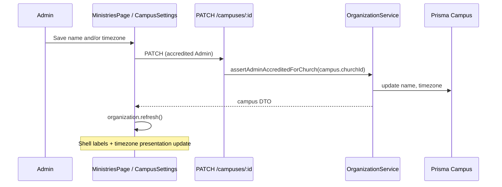

# Organization Structure Administration — Design

**Spec**: `.specs/features/organization-structure-administration/spec.md`  
**Status**: Approved (P2 slice — Campus metadata & timezone)  
**Requirements**: ORG-STRUCT-05 (primary); ORG-STRUCT-06 deferred to follow-up issue

---

## Architecture Overview

P1 shipped **Ministry** create/rename and **Church** metadata self-service (#93). P2 adds **Campus** rename and IANA timezone maintenance for accredited **Admins**, scoped to the **Campus**’s parent **Church** (tenant).

Canonical scheduling remains **UTC** on `Event`, `Assignment`, and `Unavailability`. For ministry operations, the **active Campus** timezone is the presentation anchor (e.g. **Campus Porto** for Portugal volunteers under church **Onda Dura**). **Church** `defaultTimezone` from #93 is organizational fallback only when no campus timezone applies in the resolver — P2 does **not** ask leaders to “change church timezone” to fix multi-campus locales. Existing web fallback: `activeCampus?.timezone ?? activeChurch?.defaultTimezone` (ADR 0001 — separate Church/Campus selectors).



**Ministry archive (ORG-STRUCT-06)** is out of this design: `Ministry` has no `archived`/`retired` field today; retirement needs schema + write guards across Scheduling, Availability, and Organization — separate TLC slice ([#108](https://github.com/kairan/onda-volunteer/issues/108)).

---

## Code Reuse Analysis

| Component | Location | How to use |
|-----------|----------|------------|
| Church metadata PATCH | `OrganizationService.updateChurchMetadata`, `ChurchesController` | Mirror auth, empty-body guard, `parseIanaTimezone` |
| IANA validation | `apps/api/src/common/iana-timezone.ts` | Reuse `parseIanaTimezone` for `timezone` field |
| Ministry rename | `OrganizationService.renameMinistry` | Mirror name trim/required pattern; optional per-church uniqueness (see Data) |
| Organization context | `OrganizationService.getAccessibleOrganizationContext` | Already returns `campuses[]` per church — no read-path change |
| Web settings UI | `ChurchSettingsSection.tsx`, `churchMetadata.ts` | Same section layout on `/ministries`, `refresh()` after save |
| Admin auth | `AuthenticatedRequestContext.assertAdminAccreditedForChurch` | Resolve `campus.churchId` before update |
| Error codes | Existing `ADMIN_NOT_ACCREDITED`, `INVALID_TIMEZONE` | Add `CAMPUS_*` codes aligned with church/ministry |

---

## API Design

### Endpoint

`PATCH /campuses/:campusId`

**Body** (at least one field required):

```json
{
  "name": "Zona Sul",
  "timezone": "America/Sao_Paulo"
}
```

**Response** `200`:

```json
{
  "id": "cuid",
  "churchId": "cuid",
  "name": "Zona Sul",
  "timezone": "America/Sao_Paulo"
}
```

**Controller**: `CampusesController` in `apps/api/src/organization/` (register in `organization.module.ts`).

**Service**: `OrganizationService.updateCampusMetadata({ campusId, name?, timezone?, auth })`:

1. Load campus with `churchId`; `404` + `CAMPUS_NOT_FOUND` if missing.
2. `await auth.assertAdminAccreditedForChurch(campus.churchId)`.
3. Validate `name` (trim, non-empty → `CAMPUS_NAME_REQUIRED`) when provided.
4. Validate `timezone` via `parseIanaTimezone(value, 'timezone')` when provided.
5. Reject empty patch → `CAMPUS_METADATA_EMPTY` (mirror `CHURCH_METADATA_EMPTY`).
6. `prisma.campus.update` — **no** changes to `Event` / `Assignment` / `Unavailability` rows.

**Authorization errors**: `403` + `ADMIN_NOT_ACCREDITED` (existing stewardship contract).

**Non-goals for P2**: create/delete campus (System Admin provisioning only today), multi-campus bulk edit, changing `churchId`.

### Prisma

Existing model — **no migration**:

```prisma
model Campus {
  id        String @id @default(cuid())
  churchId  String
  name      String
  timezone  String
}
```

**Name uniqueness**: Spec does not require campus name uniqueness. P2 enforces non-empty name only. Optional follow-up: unique `(churchId, LOWER(name))` if product wants parity with **Ministry** names.

---

## Web Design

### Placement

`/ministries` (`MinistriesPage`) — accredited **Admin** only, alongside existing **Church settings** and **Ministry structure** sections:

1. `ChurchSettingsSection` (church name + organizational `defaultTimezone`) — shipped #93; not the multi-campus TZ lever  
2. **`CampusSettingsSection`** (new) — edit **active** campus name + IANA timezone (locale anchor for scheduling/presentation)  
3. Ministry structure — shipped P1  

Use `activeCampus` from `useOrganization()`. If the church has no campuses (edge case), hide the section. If multiple campuses, bind form to `activeCampusId` (user switches **Campus** in shell first per ADR 0001 — do not retune church default timezone for Porto vs Joinville).

### Client module

`apps/web/src/organization/campusMetadata.ts` — `updateCampusMetadata()` → `PATCH /campuses/:campusId` (same pattern as `churchMetadata.ts`).

### Timezone change UX

**Decision (open question 4):** When `timezone` changes and differs from the loaded value, show a **confirm dialog** before save (i18n under `ministries.campusSettings`). Copy explains: UTC records are unchanged; local display for this **Campus** will use the new IANA zone. No dialog for name-only saves.

### Presentation rules (unchanged storage; clarified anchor)

- Storage: UTC instants on server.  
- Display: **Campus** IANA zone when `activeCampus` is set; else church organizational `defaultTimezone`, else `UTC` — same resolver as existing routes (`activeCampus?.timezone ?? activeChurch?.defaultTimezone ?? 'UTC'`).  
- DST: Luxon/`Intl` via IANA zone — no fixed offsets.
- P2 scope: admins change presentation via **Campus** settings; church metadata section unchanged in role.

After save: `await refresh()` so shell **Campus** label and timezone cue update without reload.

---

## Testing Strategy

| Layer | File | Covers |
|-------|------|--------|
| API e2e | `apps/api/test/campus-metadata.e2e-spec.ts` | Admin rename/timezone; UTC event unchanged after campus TZ change; auth + validation |
| Web behavior | `apps/web/src/organization/campusSettings.behavior.test.tsx` | Save + `refresh`; confirm dialog on timezone change; error mapping |

Gate: `pnpm test` (API + web unit). No new Playwright slice unless Execute adds smoke — optional.

---

## P1 Tracker Parity (no code)

Spec notes P1 shipped without a GitHub issue. Execute task **T-ORG-P1-01** adds `docs/issues/done/<#>-org-structure-p1-ministry-admin.md` and links ORG-STRUCT-01–04 — documentation only.

---

## Deferred: ORG-STRUCT-06 Ministry archive

Tracked separately ([#108](https://github.com/kairan/onda-volunteer/issues/108)). Requires:

- `Ministry.archivedAt` or `archived Boolean` + migration  
- Write guards on events, assignments, memberships, roles, unavailability  
- Organization context: hide archived from active selectors, show in history reads  

Not part of P2 Execute.

---

## Requirement Mapping

| ID | Design section |
|----|----------------|
| ORG-STRUCT-05 | API `PATCH /campuses`, web `CampusSettingsSection`, tests |
| ORG-STRUCT-01–04 | P1 — reference only; T-ORG-P1-01 tracker doc |
| ORG-STRUCT-06 | Deferred #108 |
