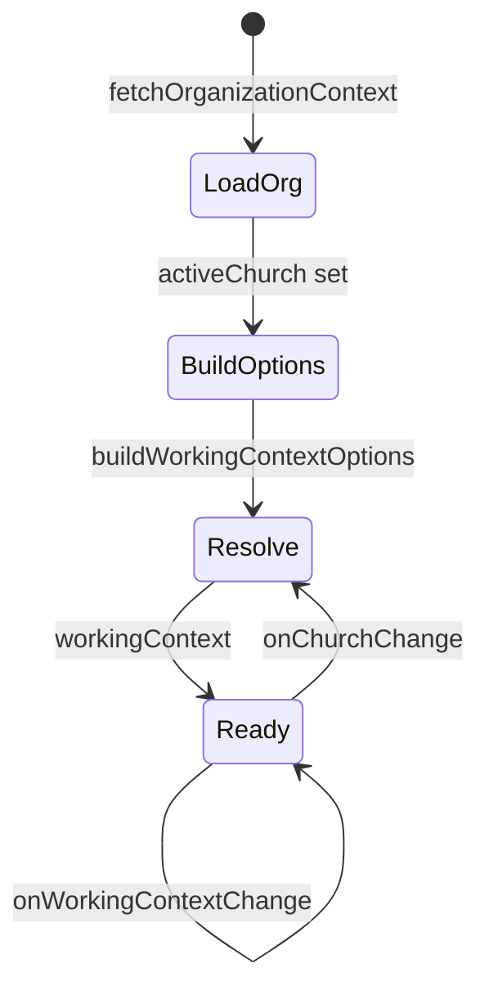

# Working context picker — Design

**Status:** Design draft (2026-07-01)  
**Spec:** [spec.md](./spec.md)  
**Decisions:** [context.md](./context.md)

---

## 1. Domain model

```typescript
// apps/web-next/src/organization/workingContext.ts

export type WorkingMode = 'leader' | 'volunteer';

/** Active hat for church-scoped UX + API leader header */
export type WorkingContext = {
  ministryId: string;
  mode: WorkingMode;
};

export type WorkingContextOption = WorkingContext & {
  ministryName: string;
};
```

**Invariants**

- `mode === 'leader'` ⇒ user has `ministry.isLeader === true` for `ministryId`
- `mode === 'volunteer'` ⇒ user has `membershipStatus === 'ACTIVE'` and not leader for that ministry
- At most **one** option per `(ministryId, mode)` pair
- At most **one** option per `ministryId` total (leader wins)

---

## 2. Option generation

```typescript
import { ministriesForShellSwitcher } from './ministryArchive';
import type { MinistrySummary } from './types';

export function buildWorkingContextOptions(
  ministries: MinistrySummary[],
  canSeeArchived: boolean,
): WorkingContextOption[] {
  const visible = ministriesForShellSwitcher(ministries, canSeeArchived);
  const options: WorkingContextOption[] = [];

  for (const m of visible) {
    if (m.isLeader) {
      options.push({
        ministryId: m.id,
        mode: 'leader',
        ministryName: m.name,
      });
      continue;
    }
    if (m.membershipStatus === 'ACTIVE') {
      options.push({
        ministryId: m.id,
        mode: 'volunteer',
        ministryName: m.name,
      });
    }
  }

  return options.sort((a, b) => {
    if (a.mode !== b.mode) {
      return a.mode === 'leader' ? -1 : 1;
    }
    return a.ministryName.localeCompare(b.ministryName, 'pt-BR');
  });
}
```

---

## 3. Resolve active context

```typescript
export function resolveWorkingContext(
  options: WorkingContextOption[],
  stored: WorkingContext | null,
  legacyMinistryId: string | null,
): WorkingContext | null {
  if (options.length === 0) return null;
  if (options.length === 1) return options[0];

  if (stored) {
    const hit = options.find(
      (o) => o.ministryId === stored.ministryId && o.mode === stored.mode,
    );
    if (hit) return hit;
  }

  if (legacyMinistryId) {
    const asLeader = options.find(
      (o) => o.ministryId === legacyMinistryId && o.mode === 'leader',
    );
    if (asLeader) return asLeader;

    const asVolunteer = options.find(
      (o) => o.ministryId === legacyMinistryId && o.mode === 'volunteer',
    );
    if (asVolunteer) return asVolunteer;
  }

  return options.find((o) => o.mode === 'leader') ?? options[0];
}
```

**Triggers to re-resolve**

- `activeChurchId` changes
- Organization context query refetch (grant revoked)
- Options list changes length or membership

---

## 4. OrganizationProvider integration

### 4.1 State diagram



### 4.2 Extended context value

```typescript
type OrganizationContextValue = {
  // existing
  churches: Church[];
  activeChurchId: string | null;
  activeCampusId: string | null;
  activeMinistryId: string | null; // mirror: workingContext?.ministryId ?? null
  activeChurch: Church | null;
  activeCampus: Campus | null;
  activeMinistry: MinistrySummary | null;

  // new
  workingContext: WorkingContext | null;
  workingContextOptions: WorkingContextOption[];
  onWorkingContextChange: (ctx: WorkingContext) => void;
};
```

### 4.3 Derivation inside provider

```typescript
const workingContextOptions = useMemo(
  () =>
    buildWorkingContextOptions(
      activeChurch?.ministries ?? [],
      Boolean(activeChurch?.isAccreditedAdmin) || isSystemAdmin,
    ),
  [activeChurch, isSystemAdmin],
);

const workingContext = useMemo(
  () =>
    resolveWorkingContext(
      workingContextOptions,
      storedWorkingContext,
      readStoredActiveMinistryId(), // one-time migration
    ),
  [workingContextOptions, storedWorkingContext, activeChurchId],
);

// sync legacy surface
const activeMinistryId = workingContext?.ministryId ?? null;
const activeMinistry =
  activeChurch?.ministries.find((m) => m.id === activeMinistryId) ?? null;
```

### 4.4 Change handler

```typescript
const onWorkingContextChange = useCallback(
  (ctx: WorkingContext) => {
    setStoredWorkingContext(activeChurchId, ctx);
    setStoredOrganizationSelection(activeChurchId, activeCampusId, ctx.ministryId);
    queryClient.invalidateQueries({ queryKey: ['leader-events'] });
    queryClient.invalidateQueries({ queryKey: ['event-detail'] });
    // assignments query is church-scoped — optional invalidate
  },
  [activeChurchId, activeCampusId, queryClient],
);
```

---

## 5. Persistence

```typescript
// organizationContextStorage.ts

const workingContextKey = (churchId: string) =>
  `onda:activeWorkingContext:${churchId}`;

export function readStoredWorkingContext(
  churchId: string,
): WorkingContext | null {
  // JSON parse { ministryId, mode }; validate mode enum
}

export function writeStoredWorkingContext(
  churchId: string,
  ctx: WorkingContext | null,
): void {
  // remove key when null
}
```

Keep `onda:activeMinistryId` writes in sync during transition; deprecate read after one release.

---

## 6. Navigation

### 6.1 Replace `buildNavForGrants`

```typescript
export type NavContextInput = {
  isAuthenticated: boolean;
  isOrgAdmin: boolean;
  workingContext: WorkingContext | null;
};

export function buildNavForWorkingContext(
  input: NavContextInput,
): NavManifestItem[] {
  if (!input.isAuthenticated) return [];

  const merged: NavManifestItem[] = [];

  if (!input.workingContext || input.workingContext.mode === 'volunteer') {
    merged.push(...VOLUNTEER_NAV);
  }

  if (input.workingContext?.mode === 'leader') {
    merged.push(...LEADER_NAV);
  }

  if (input.isOrgAdmin) {
    merged.push(...ADMIN_NAV);
  }

  return dedupeNavItems(merged);
}
```

### 6.2 AppShell wiring

```typescript
// AppShell.tsx — replace
const isLeader =
  activeChurch?.ministries.some((m) => m.isLeader) ?? false;
buildNavForGrants({ isVolunteer: isAuthenticated, isLeader, isOrgAdmin });

// with
buildNavForWorkingContext({
  isAuthenticated,
  isOrgAdmin: Boolean(activeChurch?.isAccreditedAdmin),
  workingContext,
});
```

### 6.3 Dual-role nav matrix

| Global grants | Active context | Sidebar highlights |
|---------------|----------------|--------------------|
| Leader@Louvor + Active@Kids | Kids · Voluntário | Dashboard, **My Assignments**, Time away |
| Leader@Louvor + Active@Kids | Louvor · Líder | Dashboard, Events, Roster, Volunteers, Time away |
| Leader@Louvor + Active@Kids + OrgAdmin | any + admin items | Above + Ministries, Volunteers, Leaders |

---

## 7. Routes

### 7.1 `scheduling.tsx`

```typescript
export function SchedulingPage() {
  const { workingContext } = useOrganization();

  if (workingContext?.mode === 'leader') {
    return <LeaderSchedulingPage />;
  }

  return <VolunteerMyAssignmentsPage />;
}
```

Delete `useSchedulingViewRole`.

### 7.2 `LeaderSchedulingPage`

Already resolves:

```typescript
const ministryId =
  activeMinistry?.id ?? activeMinistryId ?? ledMinistries[0]?.id ?? null;
```

After this design, **`workingContext.mode === 'leader'`** is a precondition; `ministryId` should equal `workingContext.ministryId`. Add assert/guard in dev if mismatch.

### 7.3 `VolunteerMyAssignmentsPage`

**v1 (no API change):** fetch all church assignments; optionally:

```typescript
const highlightedMinistryId =
  workingContext?.mode === 'volunteer' ? workingContext.ministryId : undefined;
// sort or badge assignments matching highlightedMinistryId first
```

**v2 (optional):** query param `?ministryId=` or new API filter.

### 7.4 `/time-away`

Pre-select ministry from `workingContext.ministryId` when mode is `volunteer`. Leader-managed volunteer time away keeps in-form ministry picker (separate route).

---

## 8. API scope helper

```typescript
// apps/web-next/src/organization/useApiScope.ts

export function useApiScope(): ProtectedScope {
  const { workingContext } = useOrganization();
  const auth = useAuthSession();
  const volunteerId =
    auth.status === 'authenticated' || auth.status === 'dev-bypass'
      ? auth.volunteerId
      : undefined;

  return {
    volunteerId,
    leaderMinistryId:
      workingContext?.mode === 'leader'
        ? workingContext.ministryId
        : undefined,
  };
}
```

Migrate leader mutations (`assignMutation`, `releaseMutation`, `capacityMutation`, unavailability on behalf) to `useApiScope()` instead of ad-hoc `activeMinistryId`.

---

## 9. Shell UI

### 9.1 `OrganizationContextControls`

**Remove** block:

```tsx
{ministries.length > 0 ? (
  <label>Ministério <select ... onMinistryChange /></label>
) : null}
```

**Add** (when `workingContextOptions.length > 1`):

```tsx
<WorkingContextPicker
  options={workingContextOptions}
  value={workingContext}
  onChange={onWorkingContextChange}
/>
```

When `length === 1`, show read-only:

`Kids · Voluntário`

### 9.2 i18n keys

```json
{
  "workingContextLabel": "Atuar como",
  "context": {
    "leader": "{{ministry}} · Líder",
    "volunteer": "{{ministry}} · Voluntário"
  },
  "contextSwitched": "Agora a atuar como {{label}}"
}
```

---

## 10. Redirect on context change

```typescript
const LEADER_ONLY_PREFIXES = ['/volunteers', '/leader/volunteer-time-away'];

function redirectIfIncompatible(
  pathname: string,
  navItems: NavManifestItem[],
): string | null {
  const allowed = new Set(navItems.map((i) => i.path));
  if ([...allowed].some((p) => pathname === p || pathname.startsWith(p + '/'))) {
    return null;
  }
  return navItems[0]?.path ?? '/dashboard';
}
```

Call after `onWorkingContextChange` via `navigate()`.

---

## 11. Files to touch (checklist)

| File | Change |
|------|--------|
| `src/organization/workingContext.ts` | **new** — build + resolve |
| `src/organization/workingContext.test.ts` | **new** |
| `src/organization/organizationContextStorage.ts` | persist per church |
| `src/organization/OrganizationProvider.tsx` | state + handlers |
| `src/organization/useApiScope.ts` | **new** |
| `src/navigation/manifest.ts` | `buildNavForWorkingContext` |
| `src/navigation/manifest.test.ts` | dual-role cases |
| `src/shell/AppShell.tsx` | nav input |
| `src/shell/OrganizationContextControls.tsx` | picker UI |
| `src/shell/WorkingContextPicker.tsx` | **new** presentational |
| `src/routes/scheduling.tsx` | remove `any(isLeader)` |
| `src/routes/LeaderSchedulingPage.tsx` | guard ministry scope |
| `src/routes/VolunteerMyAssignmentsPage.tsx` | optional highlight |
| Leader mutation modules | use `useApiScope` |

---

## 12. ASCII — shell layout after change

```text
┌─────────────────────────────────────────────────────────────┐
│ [≡]  Onda · Igreja Onda Dura                                │
├──────────────┬──────────────────────────────────────────────┤
│ Igreja    ▼  │                                              │
│ Campus    ▼  │   Main content                               │
│ Atuar como▼  │                                              │
│  Louvor·Líder│                                              │
│              │                                              │
│ Dashboard    │                                              │
│ Events       │                                              │
│ Roster       │                                              │
│ Volunteers   │                                              │
│ Time away    │                                              │
└──────────────┴──────────────────────────────────────────────┘
```

---

## 13. Risk & mitigations

| Risk | Mitigation |
|------|------------|
| Stale localStorage context after grant revoke | Re-resolve on every org fetch; fallback to first valid option |
| Leader page called with volunteer context | Route guard + `useApiScope` returns no leader header → API 403 with clear error |
| Org admin confused without picker | Admin nav still visible; picker hidden when 0 options |
| Breaking `activeMinistryId` consumers | Keep synced field; grep and migrate to `workingContext` |

---

## 14. Non-goals (this design)

- Renaming production URLs
- New `GET /organization/working-context` endpoint
- Replacing Church/Campus switchers
- Reintroducing Lovable global role dropdown
